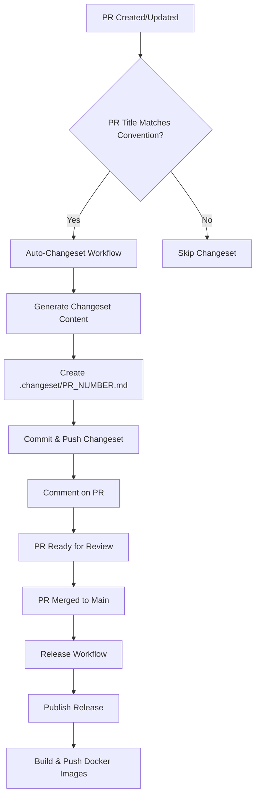

# Changeset Automation for KubeStellar UI

This document describes the implementation of automated changeset generation for the KubeStellar UI project, inspired by the [AsyncAPI CLI](https://github.com/asyncapi/cli) changeset automation workflow.

## Overview

The changeset automation system automatically generates changeset files for pull requests with conventional commit titles, helping maintain consistent versioning and release notes for the KubeStellar UI project.

## Architecture

### Components

1. **`.github/workflows/auto-changeset.yml`** - Main workflow that triggers on pull request events
2. **`.github/workflows/changeset-utils/index.js`** - Utility functions for changeset generation
3. **`.github/workflows/release-with-changesets.yml`** - Release workflow that uses changesets
4. **`.changeset/config.json`** - Changeset configuration
5. **`package.json`** - Updated with changeset scripts

### Workflow



## How It Works

### 1. Pull Request Trigger

The automation triggers on pull requests with titles that follow conventional commit format:

- `fix:` - Bug fixes (patch version)
- `feat:` - New features (minor version)
- `fix!:` - Breaking bug fixes (major version)
- `feat!:` - Breaking new features (major version)
- `docs:` - Documentation changes (patch version)
- `style:` - Code style changes (patch version)
- `refactor:` - Code refactoring (patch version)
- `perf:` - Performance improvements (patch version)
- `test:` - Test changes (patch version)
- `chore:` - Maintenance tasks (patch version)

### 2. Changeset Generation

The workflow:

1. **Checks out the PR** using GitHub CLI
2. **Installs dependencies** for package analysis
3. **Analyzes commits** to filter out merge commits and bot commits
4. **Identifies affected packages** by analyzing modified files
5. **Generates release notes** from commit messages
6. **Creates changeset content** with version bump type and release notes
7. **Commits the changeset file** to the PR branch
8. **Comments on the PR** with the generated changeset

### 3. Release Process

When changes are merged to main:

1. **Changesets action** creates a release PR or publishes directly
2. **Version bump** is applied based on changeset contents
3. **Docker images** are built and pushed with new version tags
4. **Release notes** are generated from changeset files

## File Structure

```
.github/
├── workflows/
│   ├── auto-changeset.yml          # Main automation workflow
│   ├── changeset-utils/
│   │   └── index.js                # Utility functions
│   └── release-with-changesets.yml # Release workflow
.changeset/
├── config.json                     # Changeset configuration
└── [PR_NUMBER].md                  # Generated changeset files
package.json                        # Updated with changeset scripts
```

## Configuration

### Changeset Config (`.changeset/config.json`)

```json
{
  "$schema": "https://unpkg.com/@changesets/config@2.3.1/schema.json",
  "changelog": "@changesets/cli/changelog",
  "commit": false,
  "fixed": [],
  "linked": [],
  "access": "restricted",
  "baseBranch": "main",
  "updateInternalDependencies": "patch",
  "ignore": []
}
```

### Package.json Scripts

```json
{
  "scripts": {
    "changeset": "changeset",
    "version": "changeset version",
    "release": "changeset publish"
  }
}
```

## Usage

### For Contributors

1. **Create a PR** with a conventional commit title:

   ```
   feat: add new cluster management feature
   fix: resolve authentication issue
   docs: update installation guide
   ```

2. **The automation will**:

   - Generate a changeset file (`.changeset/PR_NUMBER.md`)
   - Add it to your PR branch
   - Comment on the PR with the changeset content

3. **Review the changeset**:
   - Check the generated version bump type
   - Verify the release notes
   - Edit if needed using the provided link

### For Maintainers

1. **Merge PRs** with changesets
2. **Release workflow** will automatically:
   - Create a release PR or publish directly
   - Bump versions based on changesets
   - Build and push Docker images
   - Generate release notes

### Skipping Changeset

To skip changeset generation for a PR:

1. **Add the `skip-changeset` label** to the PR
2. **Or use a non-conventional commit title** (e.g., "Update README")

## Utility Functions

### `getFormattedCommits(pullRequest, github)`

Filters and formats commits from a pull request:

- Removes merge commits
- Removes bot commits (github-actions[bot], dependabot[bot], etc.)
- Returns commit SHA and message

### `getReleasedPackages(pullRequest, github)`

Identifies which packages are affected by changes:

- Analyzes modified files
- Reads package.json files to find package names
- Ignores documentation and configuration files
- Defaults to main package if no specific packages found

### `getReleaseNotes(pullRequest, github)`

Generates release notes from commit messages:

- Uses PR title as main description
- Lists all commits with SHA and message
- Formats for changeset consumption

### `getChangesetContents(pullRequest, github)`

Creates the final changeset content:

- Determines version bump type from PR title
- Generates release notes
- Identifies affected packages
- Returns formatted changeset content

### `commentWorkflow(pullRequest, github, changesetContents)`

Manages PR comments:

- Creates or updates comment with changeset
- Provides link to edit changeset
- Includes instructions for skipping automation

## Version Bump Rules

| PR Title Prefix | Version Bump | Description           |
| --------------- | ------------ | --------------------- |
| `fix:`          | patch        | Bug fixes             |
| `feat:`         | minor        | New features          |
| `fix!:`         | major        | Breaking bug fixes    |
| `feat!:`        | major        | Breaking new features |
| `docs:`         | patch        | Documentation         |
| `style:`        | patch        | Code style            |
| `refactor:`     | patch        | Code refactoring      |
| `perf:`         | patch        | Performance           |
| `test:`         | patch        | Tests                 |
| `chore:`        | patch        | Maintenance           |

## Docker Image Tags

When a release is published, Docker images are tagged with:

- `latest` - Latest version
- `{version}` - Specific version (e.g., `1.2.3`)

Images are pushed to:

- `ghcr.io/{owner}/ui/frontend:{tag}`
- `ghcr.io/{owner}/ui/backend:{tag}`

## Troubleshooting

### Common Issues

1. **Changeset not generated**:

   - Check PR title follows conventional commit format
   - Ensure `skip-changeset` label is not present
   - Verify workflow has proper permissions

2. **Package not detected**:

   - Check if modified files are in ignored list
   - Verify package.json exists in relevant directories
   - Check for errors in workflow logs

3. **Release not triggered**:
   - Ensure changes are merged to main/master branch
   - Check if changeset files exist
   - Verify release workflow permissions

### Debugging

Enable debug logging by checking workflow logs for:

- `console.debug()` output in utility functions
- Package detection results
- Changeset content generation

## Security Considerations

- Uses `pull_request_target` for security
- Requires proper token permissions
- Validates PR titles before processing
- Filters out bot commits to prevent spam

## Future Enhancements

Potential improvements:

- Support for monorepo with multiple packages
- Custom changelog templates
- Integration with external release tools
- Slack notifications for releases
- Automated dependency updates with changesets

## References

- [AsyncAPI CLI Changeset Implementation](https://github.com/asyncapi/cli)
- [Changesets Documentation](https://github.com/changesets/changesets)
- [Conventional Commits](https://www.conventionalcommits.org/)
- [GitHub Actions Documentation](https://docs.github.com/en/actions)
