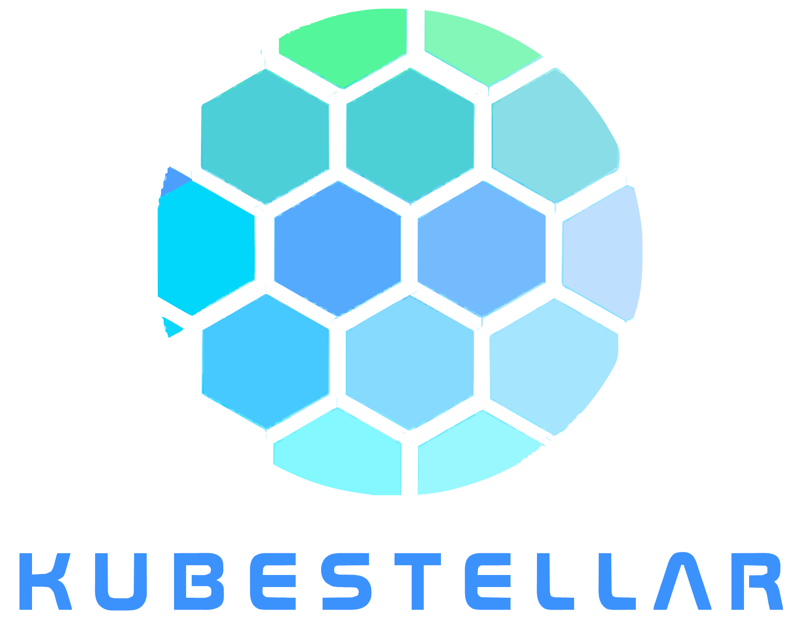

<p align="center">
  
</p>

<h2 align="center">Multi-cluster Configuration Management for Edge, Multi-Cloud, and Hybrid Cloud</h2>

<p align="center">
  <strong>
    <a href="https://kubestellar.io/">Read more about KubeStellar</a>
  </strong>
</p>

> Check out the main [KubeStellar project](https://github.com/kubestellar/kubestellar)

# KubestellarUI Setup Guide

Welcome to **KubestellarUI**! This guide will help you set up the KubestellarUI application on your local machine after cloning the repository for development. The application consists of two main parts:

1. **Frontend**: Built with React and TypeScript
2. **Backend**: Built with Golang using the Gin framework.

<a href="https://kubernetes.slack.com/archives/C058SUSL5AA"> 
  
</a>
<a href="https://deepwiki.com/kubestellar/ui">
  
</a>

## Contents

- [Prerequisites](#prerequisites)
- [Installation Steps](#installation-steps)
  - [Local Setup](#local-setup)
  - [Local Setup with Docker Compose](#local-setup-with-docker-compose)
- [Accessing the Application](#accessing-the-application)

## Prerequisites

**Before you begin, ensure that your system meets the following requirements:**

### 1. Golang

- **Version**: 1.23.4
- **Download Link**: [Golang Downloads](https://golang.org/dl/)

### 2. Node.js and npm

- **Node.js Version**: ≥ 16.x.x
- **npm Version**: Comes bundled with Node.js
- **Download Link**: [Node.js Downloads](https://nodejs.org/en/download/)

> [!NOTE]
> You can use [nvm](https://github.com/nvm-sh/nvm) to manage multiple Node.js versions.

### 3. Git

- Ensure Git is installed to clone the repository
- **Download Link**: [Git Downloads](https://git-scm.com/downloads)

### 4. Kubernetes Clusters

- Ensure you have access to a Kubernetes clusters setup with Kubestellar Getting Started Guide & Kubestellar prerequisites installed

- **Kubestellar guide**: [Guide](https://docs.kubestellar.io/release-0.25.1/direct/get-started/)

> [!NOTE]  
> If you're running on macOS, you may need to manually add a host entry to resolve `its1.localtest.me` to `localhost` using:
>
> ```bash
> echo "127.0.0.1 its1.localtest.me" | sudo tee -a /etc/hosts
> ```

### 5. Make and Air

- Make sure you have "make" installed to directly execute the backend script via makefile
- Air helps in hot reloading of the backend
- **Air guide**: [Guide](https://github.com/air-verse/air#installation)

## Installation Steps

Clone the Repository

```bash
git clone https://github.com/your-github-username/ui.git

cd ui
```

Then go through one of the setup options below:

- [Local Setup](#local-setup)
- [Local Setup with Docker Compose](#local-setup-with-docker-compose)

### Local Setup

#### Step 1: Create `.env` File for Frontend Configuration

To configure the frontend, copy the `.env.example` file to a `.env` file in the project root directory (where `package.json` is located).

```bash
cp .env.example .env
```

**Example `.env` file:**

```
VITE_BASE_URL=http://localhost:4000
VITE_APP_VERSION=0.1.0
VITE_GIT_COMMIT_HASH=$GIT_COMMIT_HASH
```

> [!NOTE]
> This is because `.env` files are intended to be a personal environment configuration file. The included `.env.example` in the repo is a standard that most other node projects include for the same purpose. You rename the file to `.env` and then change its contents to align with your system and personal needs.

##### Tracking Application Version and Git Commit Hash

KubestellarUI uses environment variables to track the app version and the current Git commit hash.

**Environment Variables**

| Variable               | Purpose                                 | Example                 |
| ---------------------- | --------------------------------------- | ----------------------- |
| `VITE_BASE_URL`        | Defines the base URL for API calls      | `http://localhost:4000` |
| `VITE_APP_VERSION`     | Defines the current application version | `0.1.0`                 |
| `VITE_GIT_COMMIT_HASH` | Captures the current Git commit hash    | (Set during build)      |

#### Step 2: Run Redis Container (Optional)

KubestellarUI uses Redis for caching real-time WebSocket updates to prevent excessive Kubernetes API calls.

Run Redis using Docker:

```bash
docker run --name redis -d -p 6379:6379 redis
```

Verify Redis is running:

```bash
docker ps | grep redis
```

#### Step 3: Install and Run the Backend

Make sure you are in the root directory of the project

```bash
cd backend

go mod download

# Option 1 : Start backend with hot reloading (recommended)
make dev

# Option 2 : Start backend without hot reloading
go run main.go
```

**Important:** If you run the backend directly (using `go run main.go` or `make dev`), you must ensure that both Redis and PostgreSQL are running and accessible on your local machine at the default ports (`127.0.0.1:6379` for Redis and `127.0.0.1:5432` for PostgreSQL). If they are not running, the backend will fail to start with connection errors.

- To start Redis locally (if not using Docker Compose):
  ```bash
  docker run --name redis -d -p 6379:6379 redis
  ```
- To start PostgreSQL locally (if not using Docker Compose):
  ```bash
  docker run --name some-postgres -e POSTGRES_PASSWORD=postgres -p 5432:5432 -d postgres:16
  ```
  Or use your system's service manager (e.g., `sudo service postgresql start`).

You should see output indicating the server is running on port `4000`.

#### Step 4: Install and Run Frontend

Open another terminal and make sure you are in the root directory of the project.

```bash
npm install

npm run dev
```

You should see output indicating the server is running on port `5173`.

### Local Setup with Docker Compose

If you prefer to run the application using Docker Compose, follow these steps:

> **Recommended:** Using Docker Compose is the easiest way to ensure all services (backend, frontend, Redis, PostgreSQL) are started and networked correctly. This avoids most connection issues.

#### Step 1: Ensure Docker is Installed

- **Download Link**: [Docker Downloads](https://www.docker.com/products/docker-desktop)

> [!NOTE]
> If you are using Docker Desktop, please enable host networking. To do so navigate to Settings > Resources > Network, and check the "Enable host networking" option. Finally, apply the changes and restart Docker Desktop.

> [!NOTE]
> If you are using Compose V1, change the `docker compose` command to `docker-compose` in the following steps.
> Checkout [Migrating to Compose V2](https://docs.docker.com/compose/releases/migrate/) for more info.

#### Step 2: Environment Configuration (Optional)

Docker Compose is configured to use environment variables with sensible defaults. You can customize the configuration by:

**Option 1: Using a .env file** (Recommended for persistent configuration)

Create a `.env` file in the project root directory:

```bash
cp .env.example .env
```

**Example `.env` file for Docker Compose:**

```bash
# Frontend Configuration
VITE_BASE_URL=http://localhost:4000
VITE_SKIP_PREREQUISITES_CHECK=true
VITE_APP_VERSION=0.1.0
NGINX_HOST=localhost
BACKEND_URL=http://localhost:4000
FRONTEND_PORT=5173

# Backend Configuration
BACKEND_PORT=4000
CORS_ALLOWED_ORIGIN=http://localhost:5173

# Redis Configuration
REDIS_HOST=localhost
REDIS_PORT=6379
REDIS_IMAGE=ghcr.io/kubestellar/ui/redis:latest
REDIS_CONTAINER_NAME=kubestellar-redis

# Example configurations for different environments:
# For production:
# VITE_BASE_URL=https://api.yourapp.com
# NGINX_HOST=yourapp.com
# BACKEND_URL=https://api.yourapp.com
# FRONTEND_PORT=80

# For staging:
# VITE_BASE_URL=https://staging-api.yourapp.com
# NGINX_HOST=staging.yourapp.com
# BACKEND_URL=https://staging-api.yourapp.com
```

**Option 2: Using system environment variables**

Set environment variables in your shell:

```bash
export VITE_BASE_URL=https://api.myapp.com
export NGINX_HOST=myapp.com
export BACKEND_URL=https://api.myapp.com
export FRONTEND_PORT=8080
```

**Option 3: Inline environment variables**

```bash
VITE_BASE_URL=https://api.myapp.com NGINX_HOST=myapp.com docker compose up
```

> [!NOTE]
> All environment variables have default values, so the application will work without any configuration. The defaults are suitable for local development.

##### Available Environment Variables

**Frontend Variables:**

- `VITE_BASE_URL` - Base URL for API calls (default: `http://localhost:4000`)
- `VITE_SKIP_PREREQUISITES_CHECK` - Skip prerequisites check (default: `true`)
- `VITE_APP_VERSION` - Application version (default: `0.1.0`)
- `NGINX_HOST` - Nginx server name (default: `localhost`)
- `BACKEND_URL` - Backend URL for proxy (default: `http://localhost:4000`)
- `FRONTEND_PORT` - Frontend port mapping (default: `5173`)

**Backend Variables:**

- `BACKEND_PORT` - Backend port mapping (default: `4000`)
- `CORS_ALLOWED_ORIGIN` - CORS allowed origin (default: `http://localhost:5173`)
- `REDIS_HOST` - Redis host (default: `localhost`)
- `REDIS_PORT` - Redis port (default: `6379`)

**Redis Variables:**

- `REDIS_IMAGE` - Redis Docker image (default: `ghcr.io/kubestellar/ui/redis:latest`)
- `REDIS_CONTAINER_NAME` - Redis container name (default: `kubestellar-redis`)

#### Step 3: Run Services

From the project root directory:

```bash
docker compose up --build
```

You should see output indicating the services are running.

To stop the application:

```bash
docker compose down
```

#### Step 4: Running with Custom Configuration

**With custom ports:**

```bash
FRONTEND_PORT=8080 BACKEND_PORT=3000 docker compose up
```

**With production-like settings:**

```bash
VITE_BASE_URL=https://api.production.com NGINX_HOST=production.com docker compose up
```

**Using a specific Redis image:**

```bash
REDIS_IMAGE=redis:7-alpine docker compose up
```

---

> **Note for WSL Users 🐧**
>
> If you've successfully installed the KubeStellar but they are not detected by frontend, it might be due to a communication issue between Docker and WSL.
>
> Here are a few steps to resolve it:
>
> 1. Open Docker Desktop settings and ensure WSL integration is enabled for your distribution (e.g., Ubuntu).
> 2. If the issue persists, consider uninstalling Docker Desktop from Windows and instead install Docker **directly inside your WSL environment** (e.g., Ubuntu).
> 3. After installing Docker inside WSL, reinstall the KubeStellar. This setup typically resolves the detection issues. ✅

### Accessing the Application

1. **Backend API**: [http://localhost:4000](http://localhost:4000) (or custom port if `BACKEND_PORT` is set)
2. **Frontend UI**: [http://localhost:5173](http://localhost:5173) (or custom port if `FRONTEND_PORT` is set)

#### Dashboard Default Login Credentials

- **Username: admin**
- **Password: admin**

> [!NOTE]  
> If you're encountering errors while setting up the Kubestellar UI, even after correctly following the guide, try pruning the Docker images and containers related to the KS core.  
> Rebuild them and perform a restart.
>
> This resolves almost 80% of issues caused by overridden changes during installation on existing systems.

<div>
<h2><font size="6"> Contributors </font></h2>
</div>
<br>

<center>
<a href="https://github.com/kubestellar/ui/graphs/contributors">
  
</a>
</center>
<br>

## Troubleshooting

### Backend Fails to Start: "connection refused" Errors

If you see errors like:

```
Database not responding: dial tcp 127.0.0.1:5432: connect: connection refused
pls check if redis is runnnig: dial tcp 127.0.0.1:6379: connect: connection refused
```

This means the backend cannot connect to Redis or PostgreSQL. To resolve:

- **If running locally:**
  - Make sure Redis and PostgreSQL are running on your host at the expected ports (6379 and 5432).
  - You can use Docker to start them:
    ```bash
    docker run --name redis -d -p 6379:6379 redis
    docker run --name some-postgres -e POSTGRES_PASSWORD=postgres -p 5432:5432 -d postgres:16
    ```
- **If using Docker Compose:**
  - Run `docker compose up --build` from the project root. All services will be started and networked automatically.
  - Make sure no other services are using ports 6379 or 5432 on your host.
- **Mixing local and Dockerized services:**
  - If you run the backend locally but want to connect to Redis/Postgres in Docker, ensure the ports are mapped and accessible (as in the Docker Compose file).
  - You may need to set `REDIS_HOST` and `DB_HOST` environment variables to `localhost` if ports are mapped, or to the container name if running inside Docker.

**Tip:** Docker Compose is the recommended way to avoid these issues.

If you continue to have issues, check your firewall settings and ensure no other processes are using the required ports.
