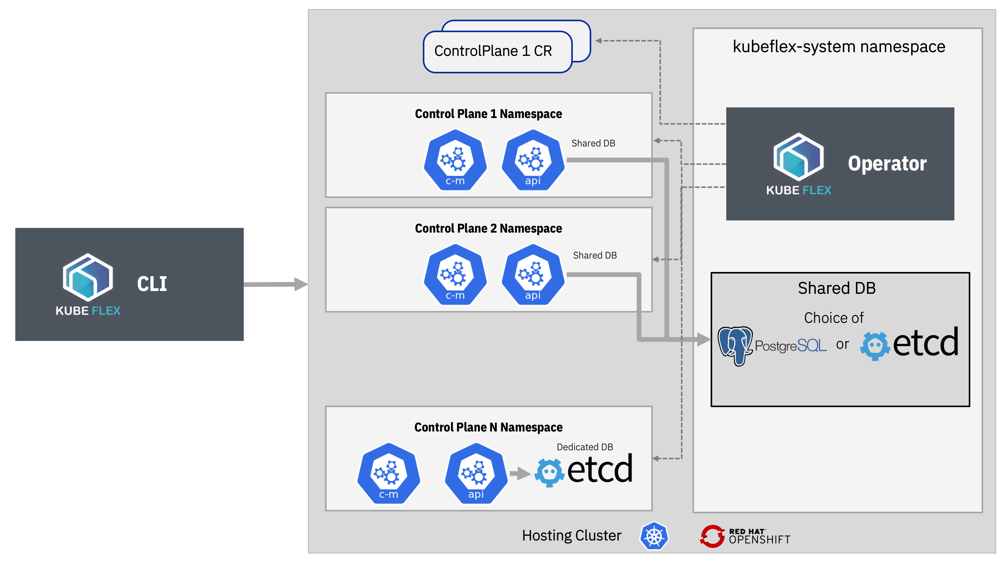

[](https://goreportcard.com/report/github.com/kubestellar/kubeflex)
[](https://github.com/kubestellar/kubeflex/releases)
[](https://github.com/kubestellar/kubeflex/actions/workflows/ci.yaml)
[](https://sonarcloud.io/summary/new_code?id=kubestellar_kubeflex)
[](https://sonarcloud.io/summary/new_code?id=kubestellar_kubeflex)

#  KubeFlex

A flexible and scalable platform for running Kubernetes control plane APIs.

## Goals

- Provide lightweight Kube API Server instances and selected controllers as a service.
- Provide a flexible architecture for the storage backend, e.g.:
  - shared DB for API servers,
  - dedicated DB for each API server,
  - etcd DB or Kine + Postgres DB
- Flexibility in choice of API Server build:
  - upstream Kube (e.g. `registry.k8s.io/kube-apiserver:v1.27.1`),
  - trimmed down API Server builds (e.g. [multicluster control plane](https://github.com/open-cluster-management-io/multicluster-controlplane))
- Single binary CLI for improved user experience:
  - initialize, install operator, manage lifecycle of control planes and contexts.

## Installation

[kind](https://kind.sigs.k8s.io) and [kubectl](https://kubernetes.io/docs/tasks/tools/) are
required. A kind hosting cluster is created automatically by the kubeflex CLI. You may
also install KubeFlex on other Kube distros, as long as they support an nginx ingress
with SSL passthru, or on OpenShift. See the [User's Guide](https://github.com/kubestellar/kubeflex/blob/main/docs/users.md) for more details.

Download the latest kubeflex CLI binary release for your OS/Architecture from the
[release page](https://github.com/kubestellar/kubeflex/releases) and copy it
to `/usr/local/bin` using the following command:

```shell
sudo su <<EOF
bash <(curl -s https://raw.githubusercontent.com/kubestellar/kubeflex/main/scripts/install-kubeflex.sh) --ensure-folder /usr/local/bin --strip-bin
EOF
```

If you have [Homebrew](https://brew.sh), use the following commands to install kubeflex:

```shell
brew tap kubestellar/kubeflex https://github.com/kubestellar/kubeflex
brew install kubeflex
```

To upgrade the kubeflex CLI to the latest release, you may run:

```shell
brew upgrade kubeflex
```

## Quickstart

Create the hosting kind cluster with ingress controller and install
the kubeflex operator:

```shell
kflex init --create-kind
```

Create a control plane:

```shell
kflex create cp1
```

Interact with the new control plane, for example get namespaces and create a new one:

```shell
kubectl get ns
kubectl create ns myns
```

Create a second control plane and check that the namespace created in the
first control plane is not present:

```shell
kflex create cp2
kubectl get ns
```

To go back to the hosting cluster context, use the `ctx` command:

```shell
kflex ctx
```

To switch back to a control plane context, use the
`ctx <control plane name>` command, e.g:

```shell
kflex ctx cp1
```

To delete a control plane, use the `delete <control plane name>` command, e.g:

```shell
kflex delete cp1
```

## Next Steps

Read the [User's Guide](https://github.com/kubestellar/kubeflex/blob/main/docs/users.md) to learn more about using KubeFlex for your project
and how to create and interact with different types of control planes, such as
[vcluster](https://www.vcluster.com) and [Open Cluster Management](https://github.com/open-cluster-management-io/multicluster-controlplane).

## Architecture



# PostgreSQL Integration

## Setup with Docker Compose

The backend now requires a PostgreSQL database. Both backend and PostgreSQL services are configured in `docker-compose.yml`.

### 1. Environment Variables

The following environment variables are used for PostgreSQL connection (with defaults):

- `POSTGRES_HOST` (default: `postgres`)
- `POSTGRES_PORT` (default: `5432`)
- `POSTGRES_USER` (default: `postgres`)
- `POSTGRES_PASSWORD` (default: `postgres`)
- `POSTGRES_DB` (default: `kubestellar`)

You can override these in your shell or in a `.env` file.

### 2. Running the Stack

To start backend, frontend, Redis, and PostgreSQL together:

```sh
docker-compose up --build
```

This will:

- Start a PostgreSQL container with persistent storage
- Start the backend, which will connect to PostgreSQL using the above environment variables
- Start frontend and Redis as before

### 3. Database Persistence

PostgreSQL data is stored in a Docker volume (`postgres_data`).

### 4. Customizing Database Credentials

You can set your own credentials by exporting environment variables before running compose:

```sh
export POSTGRES_USER=myuser
export POSTGRES_PASSWORD=mypassword
export POSTGRES_DB=mydb
docker-compose up --build
```

### 5. Troubleshooting

- Ensure ports 5432 (PostgreSQL) and 4000 (backend) are free.
- Check logs with `docker-compose logs backend` or `docker-compose logs postgres`.

### 6. Development Notes

- The backend will log a successful connection to PostgreSQL on startup.
- If the database is not ready, the backend will fail to start.

---
