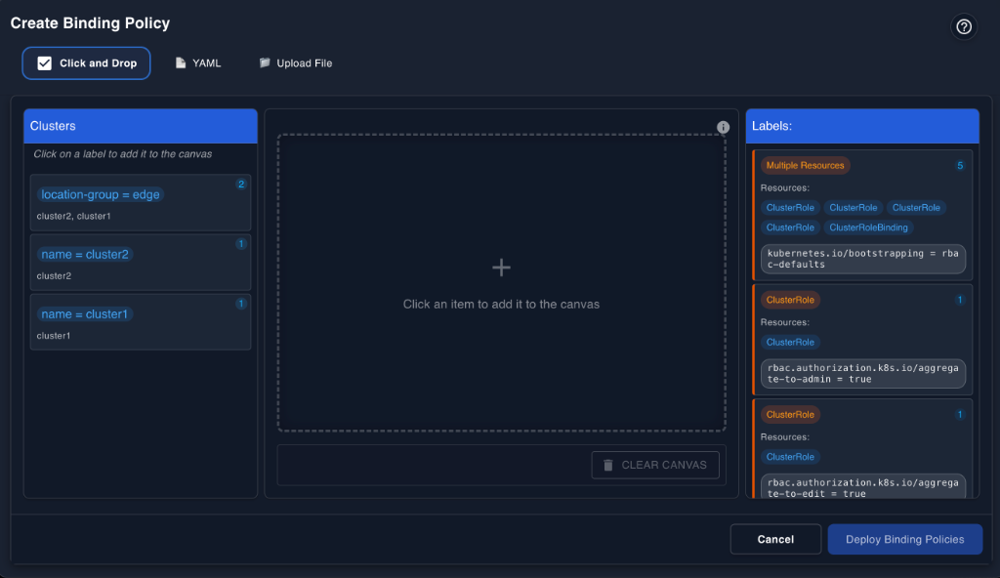
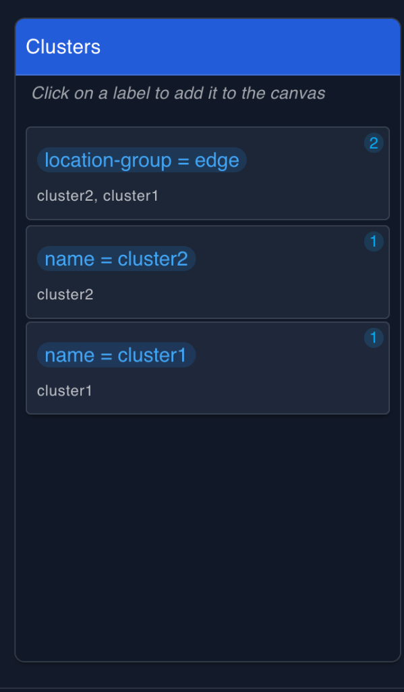
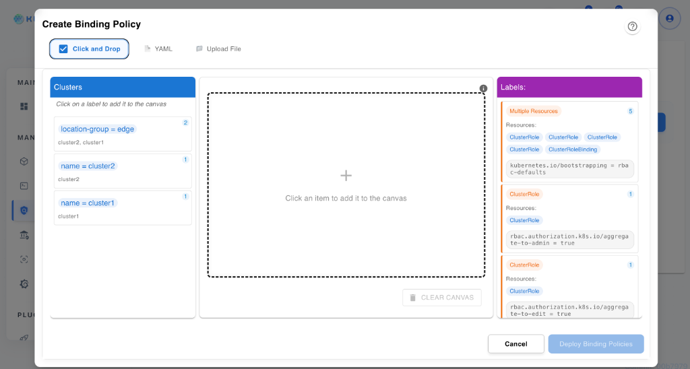
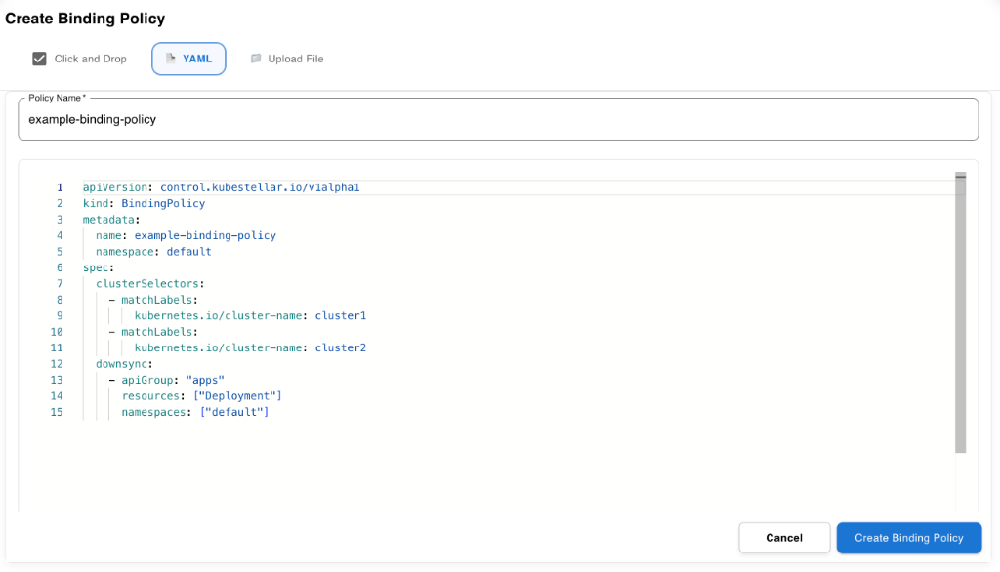
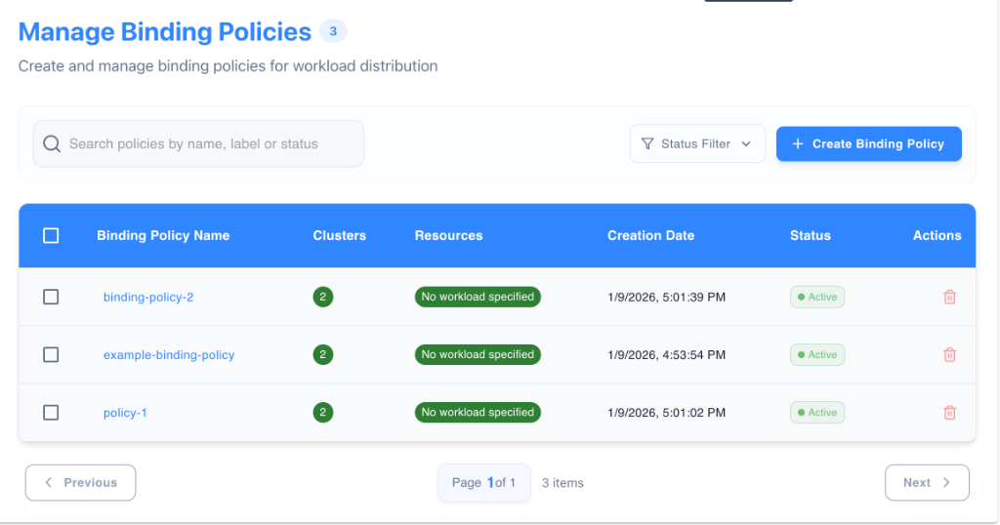

# Binding Policy Management

Binding Policies define how workloads from the Workload Description Space (WDS) are associated with clusters registered in the Inventory and Transport Space (ITS). In this document, *Binding Policy* may be abbreviated as **BP**.

## Feature Overview

The Binding Policy UI allows users to:

- Define rules for workload distribution across clusters.
- Select clusters and workloads using label selectors.
- Visually review selected cluster and workload associations prior to policy creation.
- View policy status from the policy list.

---

## Visual Policy Builder

The Visual Policy Builder provides a workspace for defining Binding Policies using a structured, panel-based layout.



### Three-Panel Layout

The interface is divided into three areas to facilitate policy creation.

#### 1. Left Panel: Clusters



The left panel displays clusters managed by the ITS.

- **Label Grouping**: Clusters are grouped by their labels.
- **Cluster Counts**: Displays the number of clusters matching each label.
- **Selection**: Clusters are added to the canvas by clicking on a label group.
- **Name Selectors**: Specific clusters can be selected using name-based labels.

#### 2. Center Panel: Canvas Workspace

The center panel acts as the staging area for the policy.

- **Clusters on Canvas**: Shows the selected cluster label groups.
- **Workloads on Canvas**: Shows the selected workload label groups.
- **Label Cards**: Each card displays the label key, value, and the match count (number of resources matching the label).
- **Clear Canvas**: A button to remove all items and reset the workspace.
- **Visual Boundary**: A dashed line defines the active workspace area.

#### 3. Right Panel: Labels / Workloads

The right panel displays available workloads from the WDS.

- **Selection**: Workloads are selected using label-based grouping, with resource kinds shown for context.
- **Resource Counts**: Shows the number of resources matching specific labels.
- **Resource Kinds**: Displays types such as `ClusterRole` or `ClusterRoleBinding`.

---

## Policy Creation Workflow

### Step 1: Open Create Binding Policy

Click the **Create Binding Policy** button to start. The builder supports three modes:

- **Click and Drop**: Visual selection of resources.
- **YAML**: Direct editing of the policy definition.
- **Upload File**: Import an existing policy file.

### Step 2: Select Clusters

Use the Left Panel to choose target clusters.

- Select clusters by clicking label cards.
- Multiple cluster selectors can be added to the canvas.
- The canvas displays the match count for selected labels.

### Step 3: Select Workloads

Use the Right Panel to choose workloads.

- Workloads are selected by label.
- Selected workloads appear separately from clusters on the canvas.
- Match counts are visible on the selected cards.

### Step 4: Deploy Policy



Once satisfied with the selection:

1. Click **Create Binding Policy**.
2. Enter a **Policy Name** (required).
3. Review the generated YAML.
4. Click **Create Binding Policy** to finalize the creation.

---

## YAML Editor

The YAML editor allows direct modification of the `BindingPolicy` resource.



> **Note**: This example shows a minimal `BindingPolicy` definition for demonstration purposes. The UI may generate YAML automatically, and available fields may vary by KubeStellar version.

Supported configurations include:

- `clusterSelectors`: Rules for targeting clusters.
- `downsync`: Rules for specifying workloads to deploy.

---

## Policy List Management

The dashboard provides a list view of existing Binding Policies.



The table displays:

- **Binding Policy Name**: The name of the policy.
- **Cluster Count**: Number of clusters targeted by the policy.
- **Resource State**: Indicates content such as *No workload specified* when applicable.
- **Creation Date**: When the policy was created.
- **Status**: A badge indicating the policy state (for example, Active or Pending).
- **Delete**: Option to remove the policy.

---

## Policy Visualization

The canvas provides a visual representation of selected cluster and workload selectors prior to policy creation.

---

## Advanced Features

### Label Selection

- `matchLabels`: Strict key-value matching.
- `matchExpressions`: Label-based logic using operators such as `In`, `NotIn`, `Exists`, and `DoesNotExist`.

### Configuration

The following options are defined in the `BindingPolicy` specification and are typically configured via YAML:

- **Propagation Strategies**: Control how resources are distributed.
- **Update Strategies**: Define how changes are applied.

---

## Binding Policy API Overview

The Binding Policy integrates with the system through Kubernetes Custom Resource Definitions (CRDs).

> **Disclaimer**: Backend APIs are internal and subject to change.

- **Group**: `control.kubestellar.io`
- **Version**: `v1alpha1`
- **Kind**: `BindingPolicy`

```yaml
# Example: minimal BindingPolicy for demonstration purposes
apiVersion: control.kubestellar.io/v1alpha1
kind: BindingPolicy
metadata:
  name: example-policy
spec:
  clusterSelectors:
    - matchLabels:
        location: edge
  downsync:
    - apiGroup: apps
      resources: [deployments]
      namespaces: [default]
