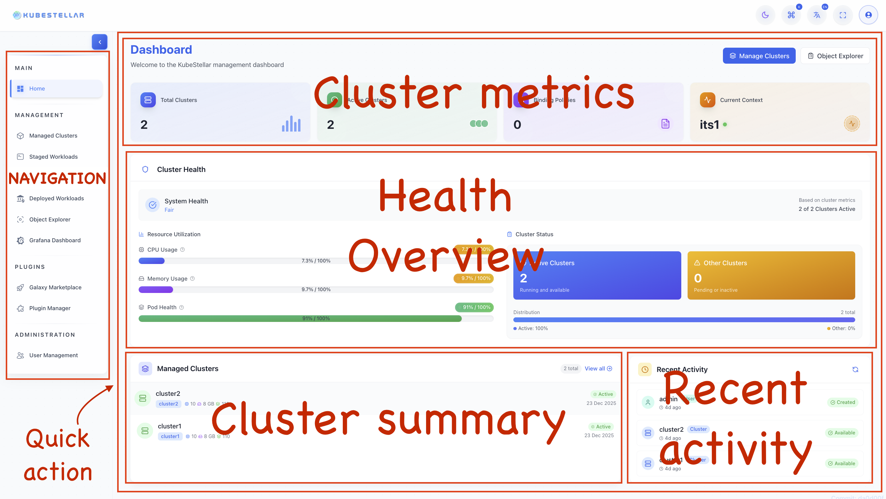
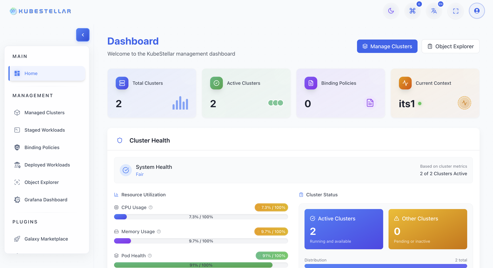
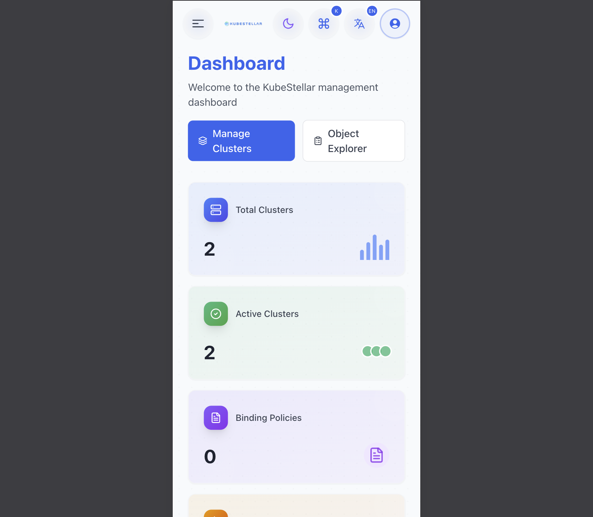
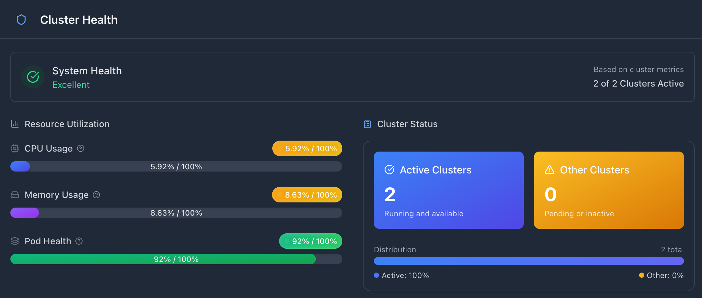
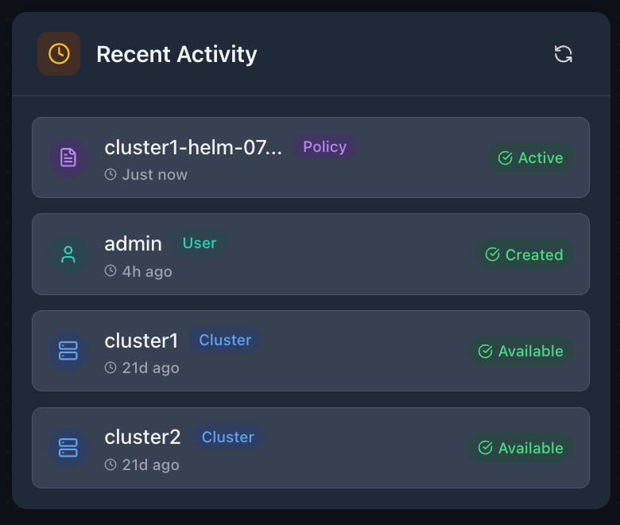
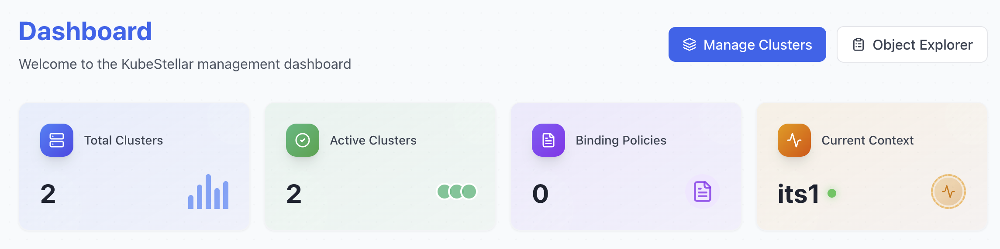
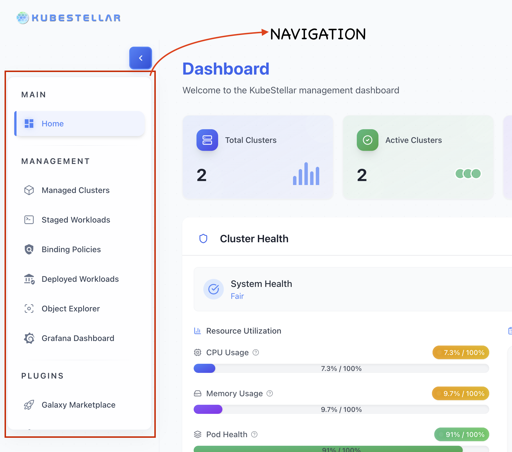

# Dashboard Overview

The Dashboard provides a unified, high-level view of your KubeStellar environment.
It helps operators quickly understand cluster health, workloads, policies, and recent activity across managed clusters — all in one place.

## Preview

The Dashboard is the primary landing page of the KubeStellar UI and provides a unified, real-time overview of the platform. It is designed to give users immediate visibility into the state of their managed clusters, system health, resource utilization, and recent activities, all from a single screen.

By presenting key metrics and visual indicators in a card-based layout, the Dashboard allows users to quickly assess cluster availability, identify potential issues, and navigate to detailed views when deeper investigation is required. Common management actions such as viewing clusters or exploring resources are also directly accessible from this page.

The Dashboard is especially useful for daily health checks, onboarding new users to the platform, and monitoring operational changes as they occur.

---
## Prerequisites

To view meaningful information on the Dashboard, the following prerequisites should be met:

- **Access to the KubeStellar UI**  
  The user must be able to log in to the KubeStellar web interface with sufficient permissions to view clusters and system metrics.

- **At least one imported cluster**  
  The Dashboard displays cluster health, resource utilization, and status information only after one or more clusters have been successfully imported into the platform. Without an imported cluster, several dashboard sections may appear empty.

- **Workloads and binding policies (optional)**  
  While not required, having workloads and binding policies configured enables additional dashboard insights, such as workload distribution and policy status. If none are defined, these sections may show zero values or limited data.


## Feature Overview

The Dashboard is designed to provide a clear and concise overview of the KubeStellar platform by surfacing the most important information in a single place. Its primary goal is to reduce the effort required to understand the state of a multi-cluster environment and enable faster operational decision-making.

### Dashboard Philosophy

The Dashboard follows a *summary-first* philosophy. Instead of exposing all details at once, it presents high-level signals that help users quickly identify normal operation or potential issues. From this overview, users can drill down into more detailed views only when necessary.

### Card-Based Layout

Information on the Dashboard is organized using a card-based layout. Each card represents a specific area of the platform, such as clusters, health status, or activity. This structure improves readability, creates a clear visual hierarchy, and allows the layout to adapt naturally across different screen sizes.

### Metric Aggregation

The Dashboard aggregates metrics from multiple platform components and presents them in a simplified form. Rather than showing raw data, it summarizes counts, health indicators, and distributions to provide immediate insight into system state.

### Real-Time Updates

Dashboard data is refreshed regularly to reflect the current state of the platform. Visual indicators and status values update as underlying conditions change, allowing users to monitor system health and activity without manually navigating between pages.

## Dashboard Layout

> **Note:** The diagram below is conceptual and illustrative, not an exact UI layout. Diagrams and screenshots are illustrative and may evolve as the UI changes.
```text
┌─────────────────────────────────────┐
│          Welcome / Alerts           │
├──────────┬──────────┬───────────────┤ 
│ Clusters │ Workloads│   Policies    │
│   Card   │   Card   │     Card      │
├──────────┴──────────┴───────────────┤
│          Resource Summary           │
├─────────────────────────────────────┤
│           Quick Actions             │
└─────────────────────────────────────┘
```

The Dashboard is divided into the following logical sections:

The dashboard employs a responsive **Grid Layout** that adapts seamlessly to mobile, tablet, and desktop screens.
- **Card Sizing:** Dynamic resizing based on viewport width.
- **Visual Hierarchy:** Critical metrics are placed at the top-left, with details flowing downwards.
- **Color Scheme:** Consistent use of status colors (Green/Yellow/Red) across all cards.

### Cluster Metrics
**Total Clusters Card**
- **Metrics:** Total count, Active, Available, Pending/Offline.
- **Visual Elements:**
  - Large number display.
  - Trend indicator (↑ ↓) showing recent changes.
  - Percentage breakdown of cluster states.

**Cluster Health Status**
- **Health Score:** Overall health percentage.
- **Breakdown:** Pie chart showing status distribution.
  - 🟢 **Green:** Healthy (Available & Syncing)
  - 🟡 **Yellow:** Warning (Degraded or Sync Issues)
  - 🔴 **Red:** Critical (Offline or Unreachable)
- **Action:** Click to view detailed metrics in the ITS interface.

**Recent Cluster Activities**
- Last imported cluster name.
- Recently updated clusters with timestamps.
- Status change alerts.

### Workload Statistics
**Total Workloads Card**
- **Metrics:** Grand total of managed workloads.
- **Type Breakdown:** Deployments, Services, StatefulSets, DaemonSets, Jobs, CronJobs.
- **Visual Elements:** Workload icons and donut charts.

**Workload Status Distribution**
- **Running:** Count and percentage.
- **Pending/Failed:** Alert counts for quick attention.
- **Succeeded:** Job completion stats.

**Namespace Distribution**
- **Top 5 Namespaces:** Horizontal bar chart showing workload volume per namespace.
- **Action:** Click to filter the Workload Description Space (WDS).

### Policy Overview
**Binding Policies Card**
- **Metrics:** Total Active vs Inactive policies.
- **Averages:** Clusters per policy, Workloads per policy.
- **Visual Elements:** Policy icon with health status indicators.

**Policy Distribution**
- **Status:** Pie chart of Active/Inactive policies.
- **Top Policies:** List of most-used policies sorted by cluster impact.

### Resource Summary
**Top Resource Types**
- **Metrics:** Counts for Pods, Services, ConfigMaps, Secrets, PVCs.
- **Visual Elements:** Horizontal bar chart with type icons.
- **Action:** Deep link to Object Explorer with pre-applied filters.

**Resource Health**
- Overall resource health score.
- Utilization warnings (if metrics server is enabled).

### Quick Actions
Prominent buttons to speed up common tasks:
- **Import Cluster:** Large primary button (Opens ITS dialog).
- **Create Workload:** Secondary button (Opens WDS dialog).
- **Create Policy:** Secondary button (Opens BP interface).
- **Browse Resources:** Navigate directly to Object Explorer.
- **View Monitoring:** Navigate to WECS for runtime metrics.

**Quick Links:**
- Direct access to ITS, WDS, BP, WECS, Galaxy Marketplace, and Documentation.

### Additional Features
**Refresh Functionality**
- **Manual:** Refresh button to reload data on demand.
- **Auto-Refresh:** Toggle with interval selector (e.g., 30s, 1m, 5m).
- **State:** Timestamps showing "Last updated" time.

**Health Indicators**
- **System Status:** Real-time dots for component health.
  - Backend API: 🟢
  - Database: 🟢
  - Redis: 🟢
  - Monitoring: 🟢




## Step-by-Step Guides

The following guides describe common workflows that can be performed using the Dashboard. Each guide focuses on practical, day-to-day actions that help users understand platform state and navigate efficiently to detailed views.

---

### Guide 1: Understanding Dashboard Metrics




*Figure: The Dashboard provides a unified overview of cluster status, system health, and navigation controls.*

1. Open the Dashboard from the **Home** section in the sidebar or by navigating to the root URL of the KubeStellar UI.
2. Review the summary cards at the top of the page to understand overall cluster availability and high-level status.
3. Examine the **Cluster Health** section to assess system health and current resource utilization.
   
4. Review workload-related information to understand the deployment and runtime state of workloads.
5. Check policy-related summaries to confirm the status of binding policies.
6. Look for any warning or alert indicators that may require further investigation.
   

---

### Guide 2: Using Quick Actions



*Figure: Quick action buttons provide direct access to common management tasks.*

1. Locate the **Quick Actions** area on the Dashboard.
2. Click **Import Cluster** to begin adding a new cluster to the platform.
3. Follow the import workflow in the Inventory and Transport Space (ITS).
4. Return to the Dashboard after completing the import process.
5. Verify that the cluster count displayed on the Dashboard has been updated.
6. Use other available quick actions to navigate to cluster management or resource exploration views.

---

### Guide 3: Navigating from the Dashboard
```text
Dashboard
 ├── Click "Import Cluster"  →  ITS Import Dialog
 ├── Click "Create Workload" →  WDS Create Dialog
 ├── Click "Create Policy"   →  BP Builder
 ├── Click "Cluster Metrics" →  ITS Page
 ├── Click "Workload Stats"  →  WDS Page
 ├── Click "Policy Overview" →  BP Page
 └── Click "Resource Sum."   →  Object Explorer
```



*Figure: Dashboard cards and sidebar navigation enable quick access to detailed cluster and workload views.*


*Figure: Tap the menu icon to access navigation in mobile view.*

1. Click on cluster-related cards or links displayed on the Dashboard.
2. Navigate to the **Managed Clusters** or ITS view to access detailed cluster information.
3. Use the breadcrumb or sidebar navigation to return to the Dashboard.
4. Select workload-related sections to navigate to the Workload Description Space (WDS).
5. Use the main navigation menu to move between different areas of the user interface.

---

### Guide 4: Refreshing Dashboard Data

1. Locate the refresh control on the Dashboard, if available.
2. Click the refresh button to reload Dashboard data.
3. Observe loading indicators while data is being refreshed.
4. Review updated metrics and status values after the refresh completes.
5. If auto-refresh options are available, enable them and configure the refresh interval as needed.

## Use Cases

The following use cases illustrate how the Dashboard can be used in common real-world scenarios to quickly understand system state and take action.

---

### Use Case 1: Morning Platform Check

**Scenario:**  
A platform engineer performs a daily health check of the multi-cluster environment at the start of the day.

**Solution:**

1. Open the Dashboard as the landing page of the KubeStellar UI.
2. Review the **Cluster Health** section to confirm that all clusters are healthy.
3. Check workload-related indicators to ensure there are no failed or unhealthy workloads.
4. Verify that active binding policies are in place and functioning as expected.
5. Look for any warning or alert indicators in the recent activity or health sections.

**Outcome:**  
The overall state of the platform can be assessed in under one minute without navigating away from the Dashboard.

---

### Use Case 2: Onboarding a New User

**Scenario:**  
An administrator introduces a new team member to the KubeStellar platform and its core capabilities.

**Solution:**

1. Start at the Dashboard to provide a high-level overview of the platform.
2. Highlight cluster counts, workload summaries, and policy-related information.
3. Use **Quick Actions** to demonstrate common tasks such as importing clusters or exploring resources.
4. Click on Dashboard cards to navigate to detailed views for clusters, workloads, and policies.
5. Reinforce the Dashboard as the central starting point for day-to-day operations.

**Outcome:**  
The new user gains a clear understanding of platform structure, navigation, and core features through a single, unified view.

---

### Use Case 3: Incident Response

**Scenario:**  
An alert or issue is reported indicating a potential problem in the platform.

**Solution:**

1. Open the Dashboard to quickly identify any red or warning indicators.
2. Determine the affected area, such as clusters, workloads, or policies.
3. Click the relevant Dashboard card to navigate to the detailed view.
4. Drill down to the specific resource or cluster causing the issue.
5. Use available actions or navigation paths to begin remediation.

**Outcome:**  
Issues can be identified and investigated quickly, reducing time to diagnosis and enabling faster resolution.

## API / Integration Reference
```text
      ITS API  →  Cluster Metrics
      WDS API  →  Workload Statistics
       BP API  →  Policy Overview
      K8s API  →  Resource Summary
                      ↓
         Dashboard (Aggregated View)
```

The Dashboard aggregates data from multiple backend services to present a unified view of platform state. The endpoints listed below are provided for reference to illustrate how Dashboard data is sourced and refreshed.

> **Note:** Endpoint names and responses may evolve over time. This section is intended for conceptual understanding rather than as a strict API contract.

---

### Backend Endpoints (Conceptual Reference)

> **Note:** The endpoints listed below are illustrative and provided for conceptual understanding of how the Dashboard sources data. They may not directly correspond to stable or publicly exposed API contracts.


The Dashboard retrieves metrics and status information using the following backend APIs:

- **GET `/api/dashboard/metrics`**  
  Retrieves aggregated Dashboard metrics, including cluster, workload, and policy summaries.

- **GET `/api/clusters/count`**  
  Returns the total number of clusters managed by the platform.

- **GET `/api/wds/count`**  
  Returns workload-related counts sourced from the Workload Description Space (WDS).

- **GET `/api/bp/count`**  
  Returns binding policy counts and related status information.

- **GET `/api/dashboard/health`**  
  Provides overall system and component health indicators used by the Dashboard.

- **GET `/api/dashboard/recent`**  
  Retrieves recent activity and event information displayed in the Dashboard activity feed.

---

### Data Refresh Behavior

Dashboard data is refreshed using a combination of initial loading and periodic updates:

- **Initial load**  
  When the Dashboard is opened, all required APIs are called in parallel to populate metrics and status indicators as quickly as possible.

- **Auto-refresh**  
  If enabled, the Dashboard periodically polls backend services to keep displayed data up to date.

- **Manual refresh**  
  Users can manually trigger a data refresh, causing the Dashboard to re-fetch data on demand.

This approach ensures that the Dashboard reflects the current state of the platform while minimizing unnecessary navigation.

## Troubleshooting

This section lists common issues that users may encounter when using the Dashboard, along with recommended steps to diagnose and resolve them.

---

### Issue 1: Metrics Not Loading

**Symptoms:**
- Dashboard cards remain empty or show loading indicators
- Health or activity sections do not display data

**Possible Solutions:**

1. Verify that backend services are running and reachable.
2. Confirm that the required API endpoints are accessible.
3. Check the browser console for network or authorization errors.
4. Refresh the Dashboard page.
5. Ensure the current user has sufficient permissions to view metrics and cluster data.

---

### Issue 2: Incorrect or Inconsistent Counts

**Symptoms:**
- Cluster, workload, or policy counts do not match expected values
- Dashboard data differs from detailed views (ITS, WDS, or BP)

**Possible Solutions:**

1. Perform a hard refresh of the page (`Ctrl + Shift + R` or equivalent).
2. Clear the browser cache and reload the Dashboard.
3. Verify counts directly in the source pages (ITS, WDS, and BP).
4. Allow time for synchronization if recent changes were made.
5. Review backend logs to identify potential data aggregation or sync issues.

---

### Issue 3: Slow Dashboard Loading

**Symptoms:**
- Dashboard takes a long time to load
- Metrics update slowly or appear delayed

**Possible Solutions:**

1. Check network latency between the browser and backend services.
2. Review backend query performance and applied filters.
3. Ensure caching mechanisms (such as Redis) are enabled and functioning correctly.
4. Reduce the auto-refresh frequency if periodic polling is enabled.

---

If issues persist after following these steps, consult platform logs or contact an administrator for further investigation.

## Related Features

The Dashboard acts as an aggregation layer and entry point to several core KubeStellar features. Data displayed on the Dashboard is sourced from, and links directly to, the following areas of the platform:

- **Inventory and Transport Space (ITS)**  
  Provides cluster inventory, connectivity status, and cluster-level metadata used for cluster metrics and health indicators.

- **Workload Description Space (WDS)**  
  Supplies workload-related data, including workload counts, deployment state, and distribution across clusters.

- **Binding Policies (BP)**  
  Contributes policy configuration and status information used to summarize how workloads are bound to clusters.

- **Object Explorer**  
  Enables detailed inspection of Kubernetes resources such as pods, services, config maps, and other objects referenced by Dashboard summaries.

- **Workload Execution and Control Space (WECS)**  
  Provides monitoring and execution-related insights, including runtime and health information for deployed workloads.

Together, these features allow the Dashboard to present a unified view while enabling seamless navigation to more detailed, task-specific interfaces.

## References

- **Dashboard implementation:**  
  `/frontend/src/pages/Dashboard.tsx`

- **End-to-end tests:**  
  `/frontend/e2e/Dashboard.spec.ts`