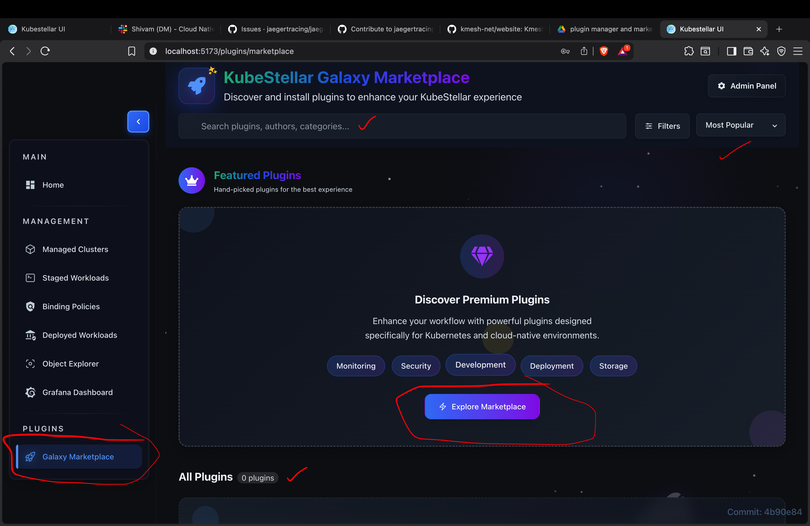
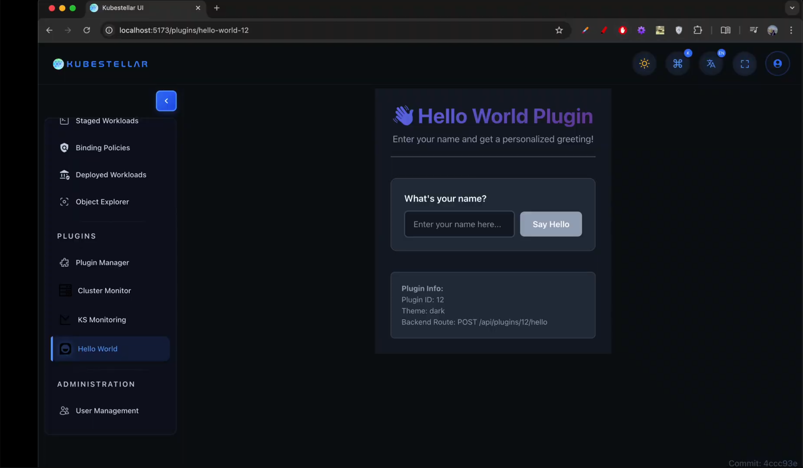
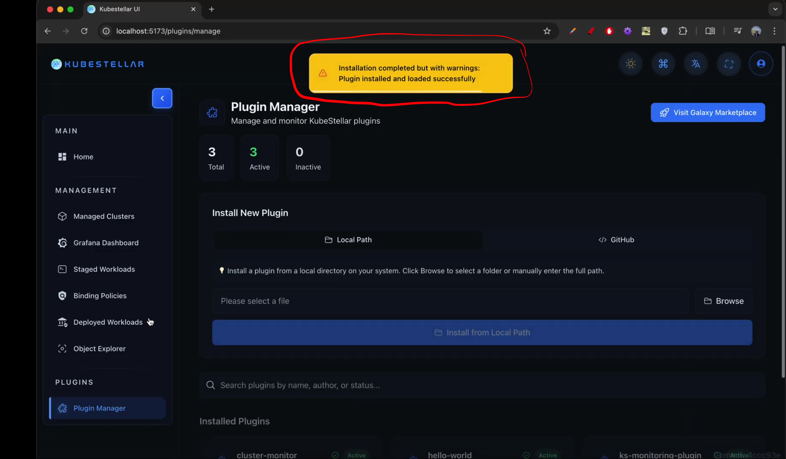
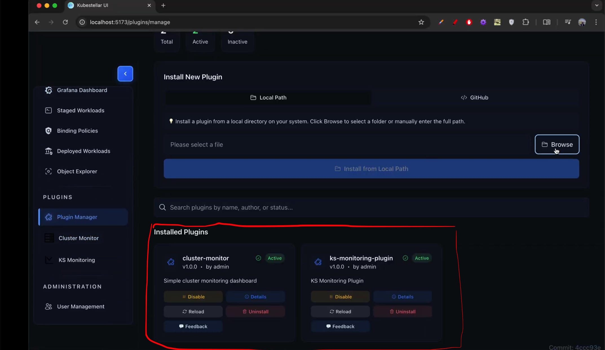
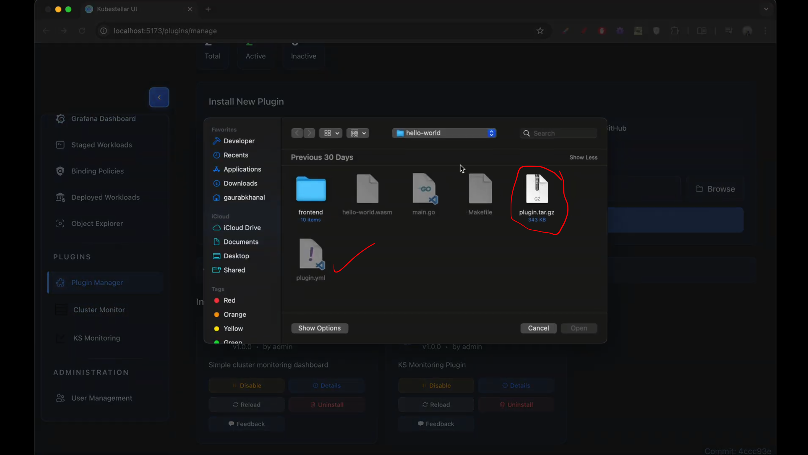
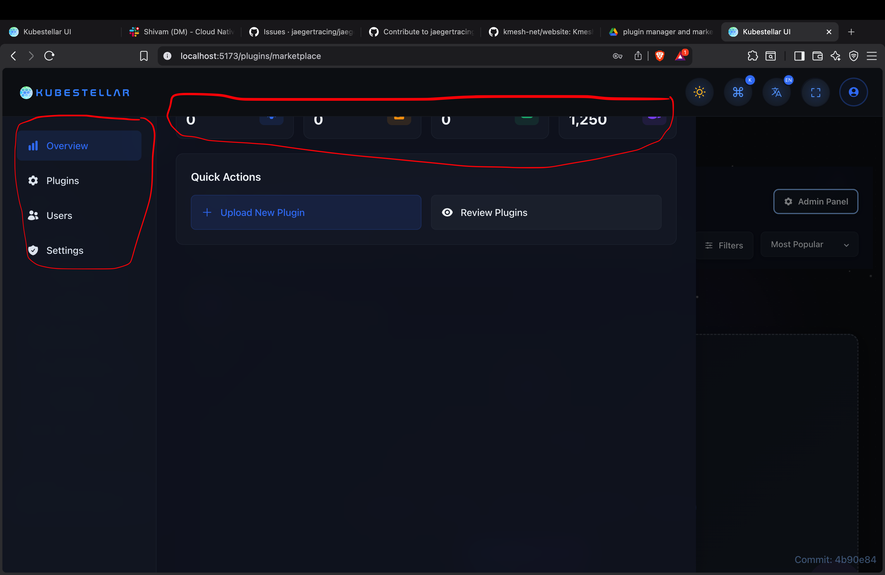

# Galaxy Marketplace

## 1. Introduction

Galaxy Marketplace is the official plugin ecosystem for **KubeStellar**, enabling users to extend platform functionality through modular, installable plugins.

It functions similarly to an app store, where users can:
- Discover plugins created by the community and core team
- Install and manage plugins with a few clicks
- Rate and review plugins
- Receive updates and improvements regularly

### Why Galaxy Marketplace?

- 🔌 Extensible platform via plugins
- 🛡️ Safe and verified installations
- 🤝 Community-driven ecosystem
- ⚙️ Easy management and updates

---

## 2. Prerequisites

Before using Galaxy Marketplace, ensure:
- Access to the KubeStellar UI
- Appropriate permissions for plugin installation
- Admin privileges (required only for plugin upload and approvals)
- Basic understanding of plugins and Kubernetes concepts

---

## 3. Feature Overview

Galaxy Marketplace supports the full lifecycle of plugins:
- Discovery and search
- Installation and configuration
- Updates and version management
- Reviews, ratings, and community feedback
- Admin moderation and publishing workflows

---

## 4. Marketplace Interface

### Layout

The marketplace landing page consists of a hero section, featured carousel, category sidebar, and grid view.


> **Figure 1: Marketplace Home Page**
> 1. **Hero Search:** Prominent search bar for quick lookup.
> 2. **Featured Carousel:** Highlights new and popular plugins.
> 3. **Categories:** Sidebar navigation for filtering by domain (Security, AI/ML, etc).
> 4. **Plugin Grid:** Main display area for plugin cards.

### Plugin Card Design

Each plugin card displays essential information at a glance.

![Plugin Card Design]
> **Figure 2: Plugin Card Anatomy**
> 1. **Identity:** Plugin icon and official name.
> 2. **Metadata:** Publisher name, version, and star rating.
> 3. **Metrics:** Total download count.
> 4. **Action:** Primary "Install" button (or "Manage" if installed).

---

## 5. Plugin Discovery

### Search Functionality

Users can search plugins by:
- Name
- Description keywords
- Author name
- Tags

![Search Results Interface]
> **Figure 3: Search Results**
> 1. **Active Query:** Shows the current search term.
> 2. **Filters:** Active chips for categories or tags.
> 3. **Sorting:** Dropdown to sort by Relevance, Popularity, or Rating.

### Categories

Available categories include:
- Monitoring & Observability
- Security & Compliance
- Networking
- Storage
- CI/CD & DevOps
- Databases
- Service Mesh
- AI/ML
- Custom Resources
- Utilities

---

## 6. Plugin Details View

### Overview Tab

The overview provides the full context needed to decide on installation.


> **Figure 4: Plugin Details Page**
> 1. **Header:** Large icon, ratings summary, and publisher info.
> 2. **Action Bar:** Install, Update, or Uninstall buttons.
> 3. **Readme:** Full markdown description of features.
> 4. **Sidebar:** Quick stats (License, Size, Version history).

### Screenshots & Media

- Screenshot gallery
- Embedded demo videos
- Architecture diagrams
- Lightbox view with navigation

### Ratings & Reviews

- Average rating
- Star distribution histogram
- User reviews with sorting
- Helpful votes
- Author replies

### Changelog & Dependencies

- **Changelog:** Version history, bug fixes, and breaking changes.
- **Dependencies:** Required Kubernetes versions or other plugin dependencies.

---

## 7. Plugin Installation

### Installation Flow

1. Click **Install**
2. Review confirmation dialog.
3. Accept terms.
4. Track progress.


> **Figure 5: Installation Confirmation**
> 1. **Permissions:** List of cluster permissions the plugin requests.
> 2. **Dependencies:** Auto-detected required dependencies.
> 3. **Progress:** Status bar showing "Downloading" -> "Installing" -> "Configuring".

### Installation Options

- Install specific version
- Enable auto-updates
- Configure during installation
- Advanced installation paths

---

## 8. Plugin Management

### My Plugins

Manage your installed extensions from a central dashboard.


> **Figure 6: My Plugins Management**
> 1. **Status Indicators:** 🟢 Active, 🔴 Error, 🔵 Updating.
> 2. **Version Control:** Shows current version vs. available updates.
> 3. **Quick Actions:** Toggle switch (Enable/Disable), Configure (Gear icon), and Delete (Trash icon).

### Update Management

- Update available badges
- Update all option
- Changelog preview before updating
- Auto-update toggles

---

## 9. Plugin Upload (Admin)

### Upload Process (Admin Only)

Admins can upload `.tar.gz` bundles containing the plugin manifest and binaries.


> **Figure 7: Plugin Upload**
> 1. **Drag & Drop:** Area to upload the `.tar.gz` file. 
> 2. **Validation:** Real-time checklist (Manifest check, Security scan).
> 3. **Metadata Form:** Fields to add tags, categories, and visibility settings.

---

## 10. Admin Features

Admins can approve/reject plugins, feature items, and view analytics.


> **Figure 8: Admin Dashboard**
> 1. **Stats:** Total downloads, active plugins, and new users.
> 2. **Pending Queue:** List of plugins awaiting approval.
> 3. **Moderation:** Controls to feature, hide, or ban plugins.

---

## 11. System Diagrams

This section visually explains the backend workflows.

### Plugin Lifecycle

```mermaid
flowchart LR
  Discovery --> Install --> Configure --> Enable --> Use --> Update --> Uninstall

flowchart LR
  Developer[Developer Upload] --> Validation{Auto Validation}
  Validation -->|Fail| Rejected
  Validation -->|Pass| AdminReview[Admin Review]
  AdminReview -->|Approve| Published
  AdminReview -->|Reject| Rejected
  Published --> Marketplace

flowchart TD
  User[User Clicks Install] --> UI[Frontend UI]
  UI --> API[Backend API]
  API --> Check{Dependencies Met?}
  Check -- No --> Error[Prompt User]
  Check -- Yes --> Download[Download Artifact]
  Download --> Extract[Extract to Cluster]
  Extract --> Configure[Apply Config]
  Configure --> Ready[Plugin Ready]

---

## 12. Step-by-Step Guides

   The following guides cover the most common operations in the Marketplace.

   ### User Guides

      Browsing the Marketplace Navigate using the sidebar categories or browse the "Featured" carousel to find new tools.

      Searching for Plugins Use the search bar to find plugins by name, tag (e.g., #security), or publisher. Results update in real-time.

      Installing a Plugin Click "Install", review the required permissions and dependencies in the popup, and confirm to start deployment.

      Rating and Reviewing Plugins After installation, scroll to the "Ratings" tab on the plugin page to leave a star rating and written review.

      Updating Plugins Go to "My Plugins." If an update is available, a blue badge will appear. Click "Update" to apply the latest version.

      Uninstalling Plugins In "My Plugins," click the trash icon. Confirm removal to delete the plugin and its associated configuration.

      Managing Installed Plugins Use the toggle switch in "My Plugins" to temporarily disable a plugin without uninstalling it.

      Configuring Plugins Click the gear icon ⚙️ on any active plugin to open its specific settings panel.

      Reviewing Plugin Changelogs Before updating, click the "Changelog" tab to see what features have been added or bugs fixed.

      Admin Guides

      Uploading a Plugin As an admin, navigate to the "Upload" page, drag in your .tar.gz bundle, fill in metadata, and submit for validation.

---

## 13. Use Cases
   ### Examples of how Galaxy Marketplace provides value:

      Observability Stack: A user installs the "Prometheus Bundle" and "Grafana Widget" to instantly enable cluster monitoring.

      Security Compliance: An admin installs a "Security Scanner" plugin that automatically checks all namespaces for vulnerability compliance.

      Custom Dashboarding: A developer installs a "UI Widget" plugin to add a custom status panel to the main KubeStellar dashboard.

      Developer Publishing: A third-party developer packages a tool, uploads it to the Marketplace, and tracks usage stats.

      Curated Experiences: The platform admin uses the "Featured" tools to pin essential plugins (like Networking or Storage) for all new users.

---

## 14. API Reference
   Key endpoints for Marketplace integration:

   ### Method   Endpoint               Description
      GET	   /api/v1/plugins	   List all plugins with pagination and filters.
      GET	   /api/v1/plugins/{id}	   Get detailed metadata for a specific plugin.
      POST	   /api/v1/install/{id}	   Trigger the installation process for a plugin.
      POST	   /api/v1/upload	(Admin)  Upload a new plugin bundle via multipart/form-data.
      GET	   /api/v1/manifest/schema	   Retrieve the JSON schema for validating plugin.yaml.

---

## 15. Troubleshooting
   Common issues and remediation steps:

   ### Issue	          Possible Cause                        Solution
   Installation Fails	 Network timeout or permission denied	Check cluster internet access and ensure your user role has install permissions.
   Plugin Not Appearing	 Caching issue	                        Refresh the browser or clear the application cache.
   Validation Error	    Invalid Manifest	                     Ensure your plugin.yaml follows the strict schema version.
   Update Stuck	       Locked resource	                     Restart the KubeStellar agent or manually delete the pending pod.
   Upload Rejected       Security Audit Fail	                  The binary contains restricted patterns; check the security report for details.