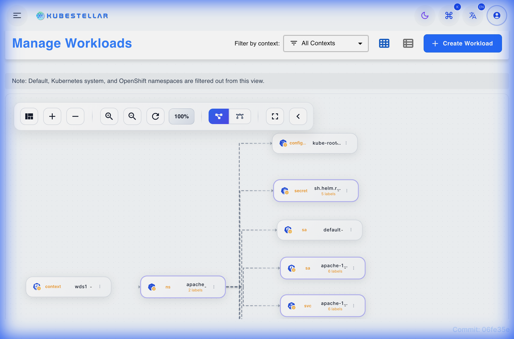
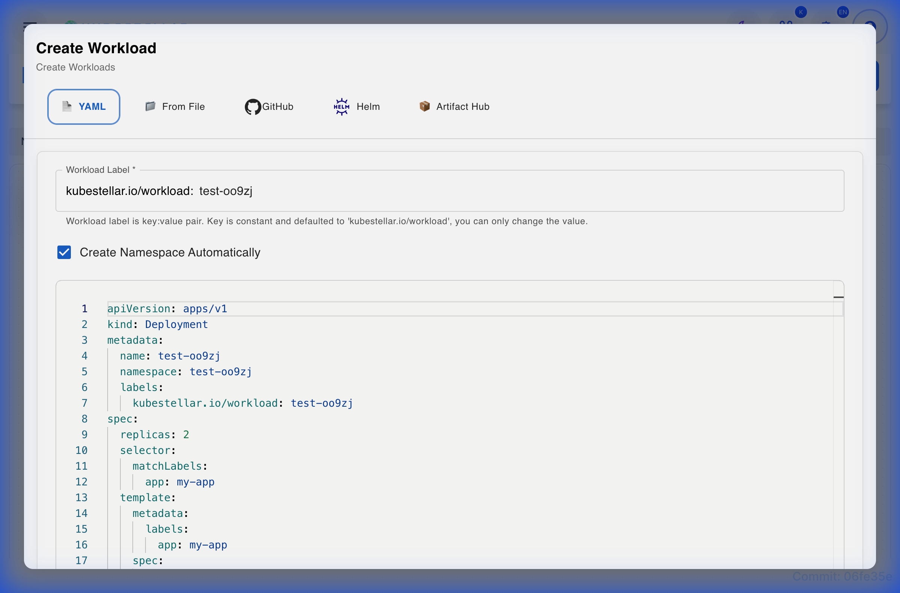
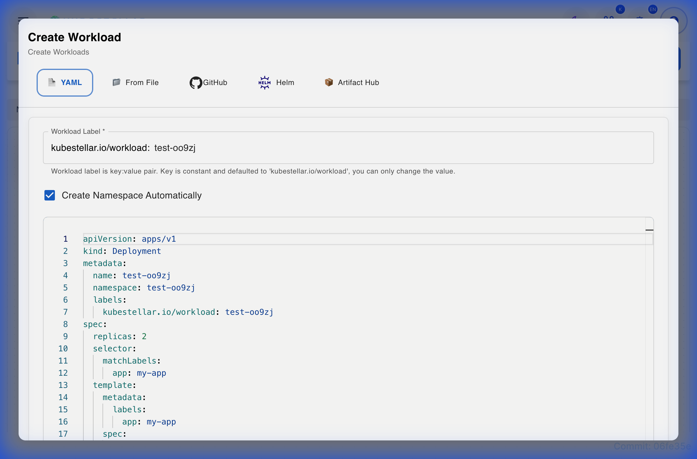
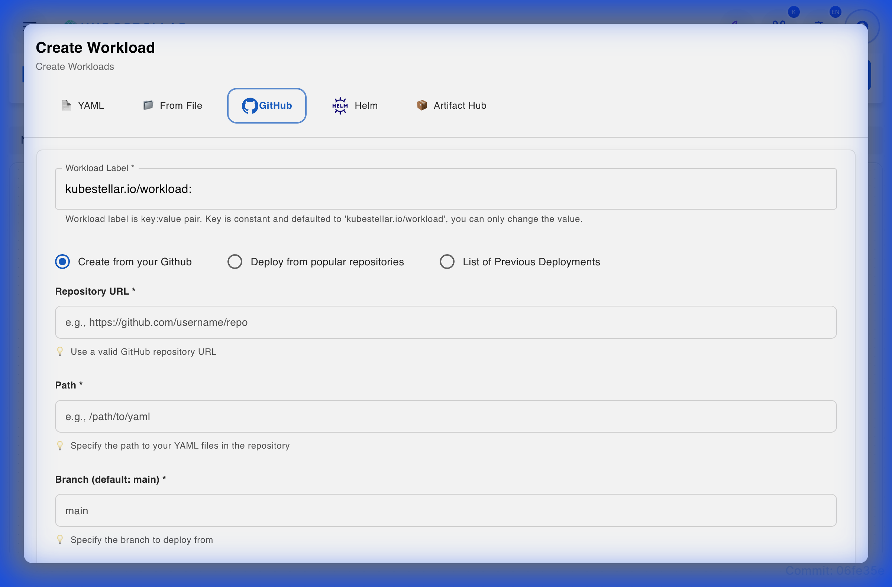
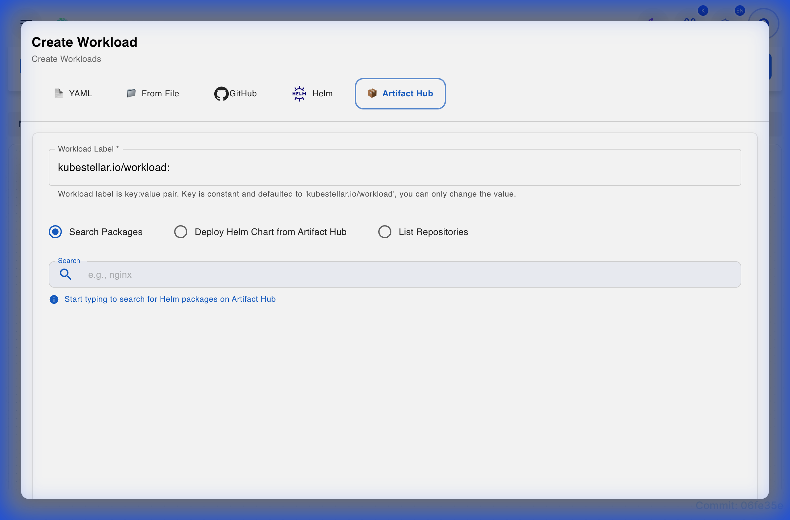
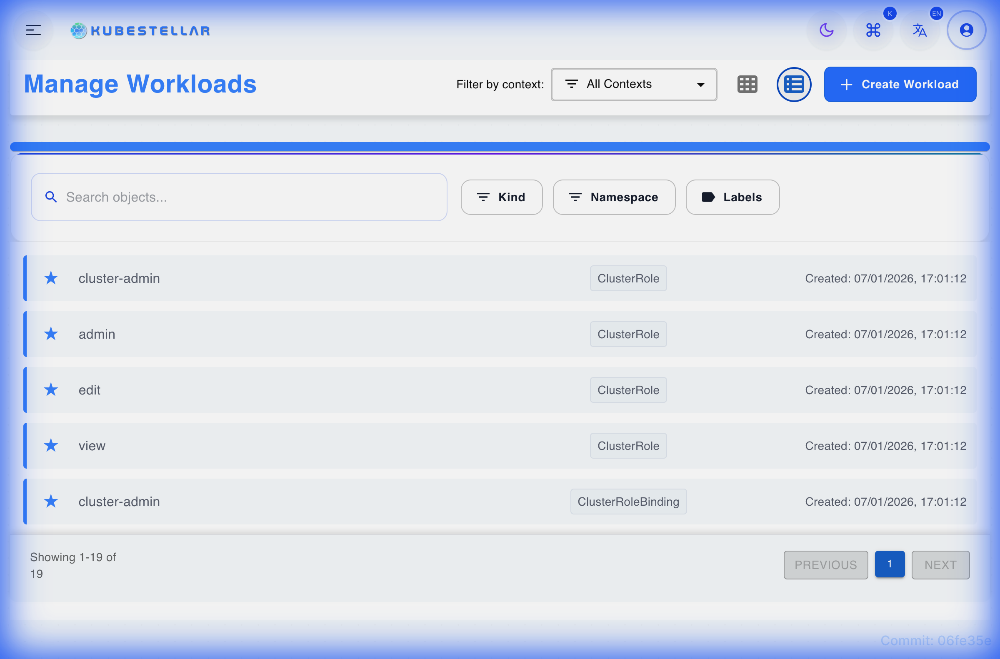

# Workload Distribution Space (WDS)

The Workload Distribution Space (WDS) is a core component of KubeStellar that enables you to define, distribute, and manage workloads across multiple Kubernetes clusters. It provides a centralized control plane where you can define *what* to deploy (workloads) and *where* to deploy it (binding policies).

## Key Features

*   **Tree View Visualization**: Visualize the relationship between your WDS, namespaces, and resources in a hierarchical graph.
*   **Multiple Import Methods**: Import workloads from various sources including YAML, GitOps, and Helm.
*   **Status Tracking**: Monitor the propagation status of your workloads across managed clusters.
*   **Flexible Visualization**: Switch between Graph and List views to manage your resources effectively.

## Accessing WDS

To access the Workload Distribution Space:
1.  Navigate to the KubeStellar UI.
2.  Click on **Staged Workloads** or **WDS** in the side navigation menu.

## Creating and Importing Workloads

KubeStellar supports multiple methods to bring your workloads into the WDS. Click the **Create Workload** button to open the creation dialog.

### 1. YAML Definition
For quick resources or testing, you can define your Kubernetes resources directly using the inline YAML editor.

1.  Select the **YAML** tab.
2.  Paste or type your Kubernetes manifest (e.g., Deployment, Service, ConfigMap).
3.  Click **Create** to apply the manifest to the WDS.

### 2. File Upload
Upload existing manifest files directly from your local machine.
1.  Select the **From File** tab.
2.  Drag and drop your `.yaml` or `.json` files, or click to browse.
3.  Click **Upload** to process the files.

### 3. GitHub Integration
Deploy workloads directly from public or private GitHub repositories.

**Options:**
*   **From your repositories**: Connect your GitHub account to list and select from your personal/org repositories.
*   **Deploy from URL**: Directly paste a link to a GitHub folder or file containing manifests.
*   **Previous Deployments**: Quickly redeploy from your history.

### 4. Helm Charts
Search and deploy Helm charts from configured repositories.
1.  Select the **Helm** tab.
2.  Search for a chart (e.g., `nginx`, `redis`).
3.  Configure values in the provided editor.
4.  Click **Install**.

### 5. Artifact Hub
Discover and install packages from the distributed artifact hub.

1.  Select the **Artifact Hub** tab.
2.  Search for packages across the ecosystem.
3.  Select a specific version and install.

### 6. GitOps Sync
(Advanced) Configure continuous synchronization with a Git repository. This ensures your WDS state always matches your Git source of truth.

### 7. URL Import
Import raw manifest content from any accessible URL (e.g., raw GitHub content, Gist).

## Visualizing Workloads

WDS provides two primary ways to view your managed resources:

### Graph View
The default **Graph View** provides a topological representation of your resources.
*   **Hierarchy**: Shows `WDS -> Namespace -> Resource Type -> Resource`.
*   **Interactive**: Click on nodes to view details or expand/collapse sections.
*   **Layouts**: Switch between different graph layouts (e.g., Tree, Force-Directed) using the controls.

### List View
For a dense, tabular view of all resources, switch to the **List View**.

*   **Filtering**: Filter resources by Name, Namespace, or Kind.
*   **Sorting**: Sort by creation time or status.
*   **Actions**: Perform bulk actions like deletion.

## Managing Workloads

### Scaling Workloads
You can scale Deployments and StatefulSets directly from the WDS.
1.  Select the workload in either Graph or List view.
2.  Click the **Scale** action.
3.  Enter the desired number of replicas.

### Deleting Workloads
To remove a workload from WDS (and subsequently from all bound clusters):
1.  Select the workload.
2.  Click **Delete**.
3.  Confirm the action.

## Troubleshooting

### Common Issues

*   **Workload Not Propagating**:
    *   Check your **Binding Policies**. A workload must be matched by a policy to be delivered to clusters.
    *   Verify the status of the `BindingPolicy` object.
*   **Import Failures**:
    *   Ensure your YAML is valid.
    *   For GitHub imports, verify the repository is accessible and the path is correct.

### Help & Support
If you encounter issues, please check the system logs or open an issue on our GitHub repository.
