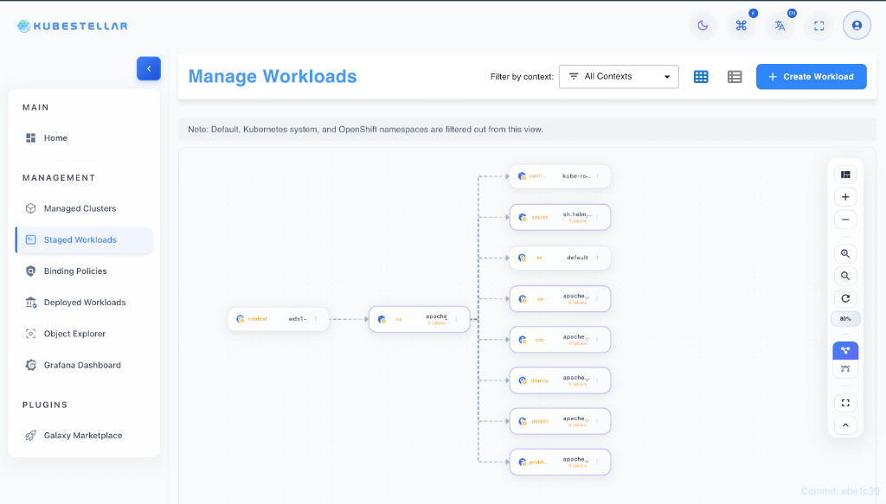
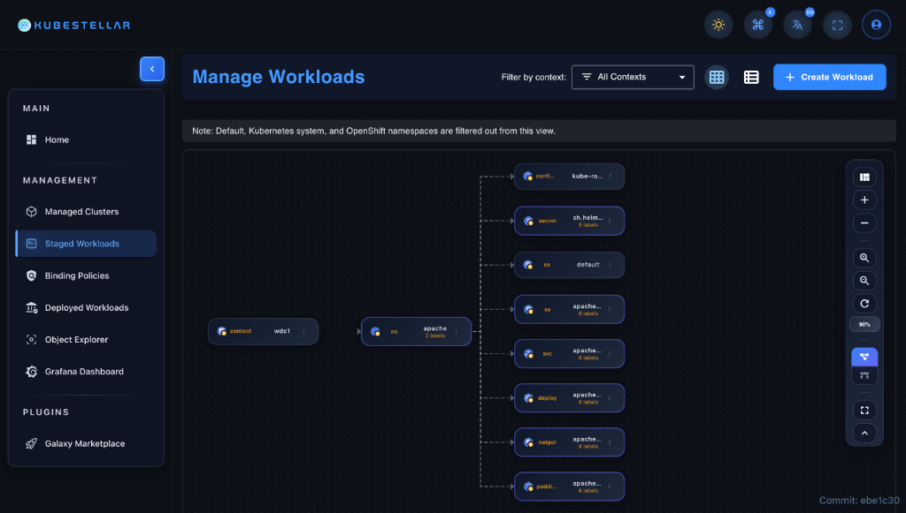
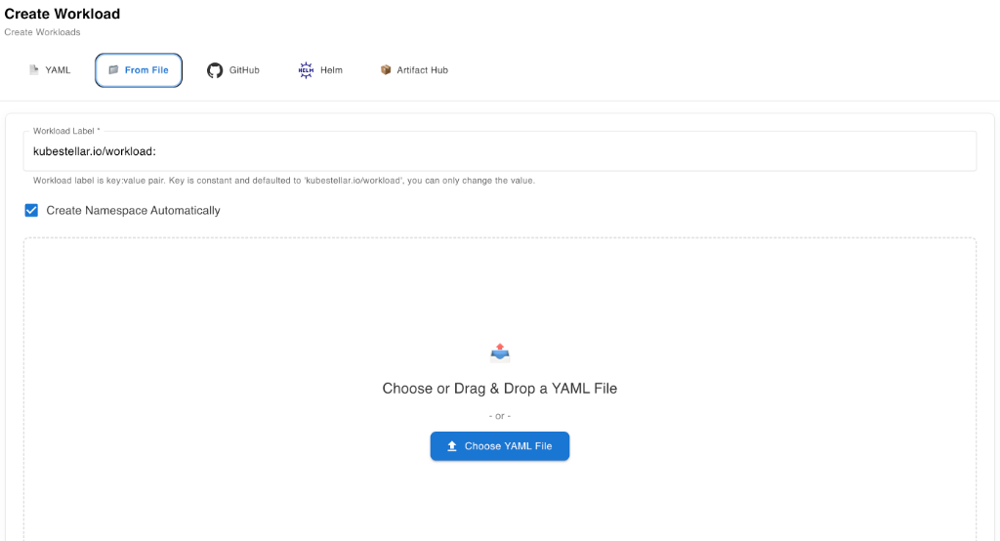
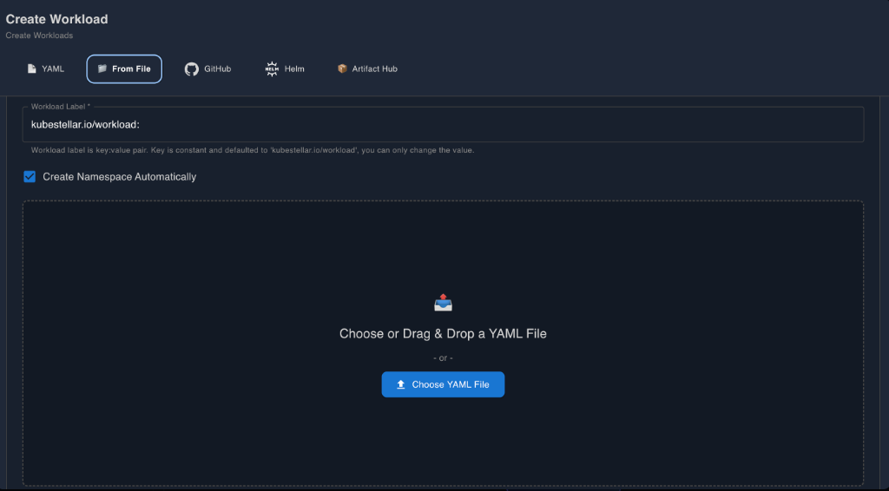
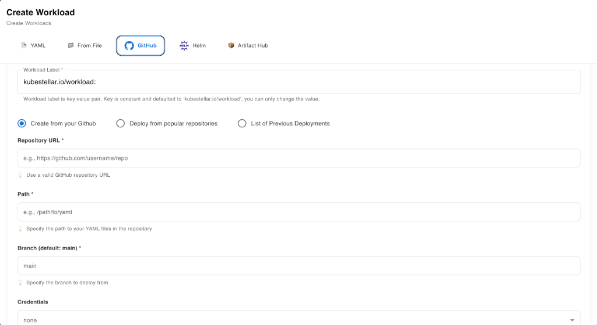
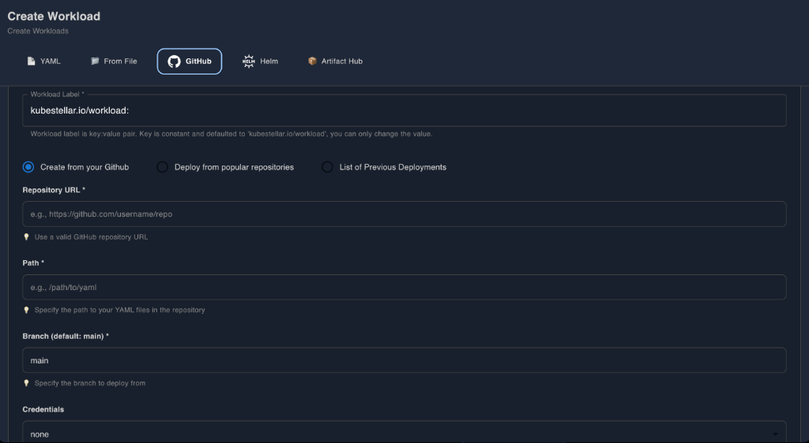
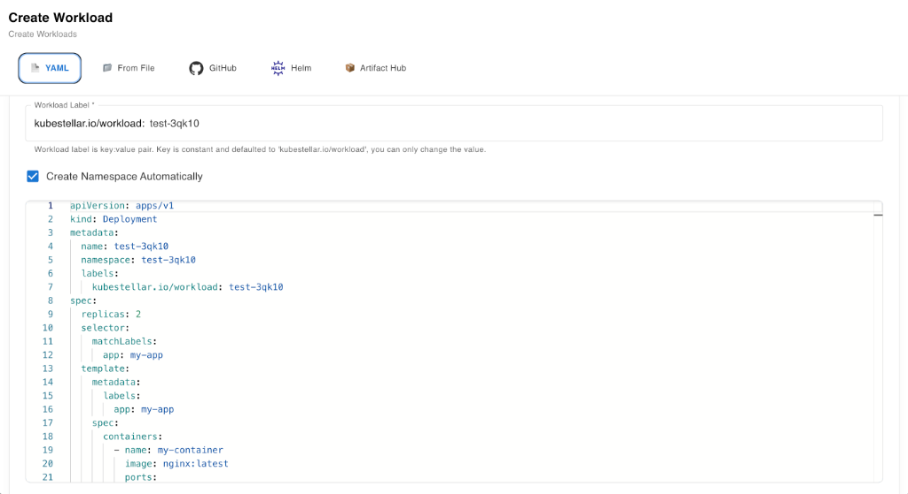
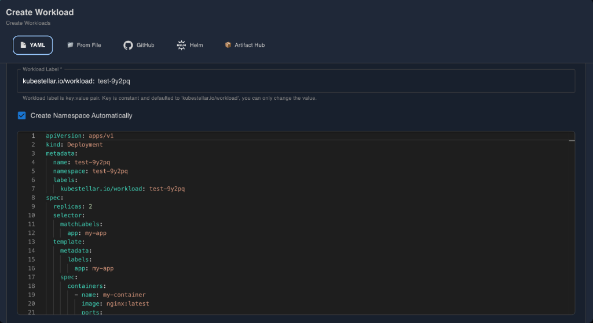
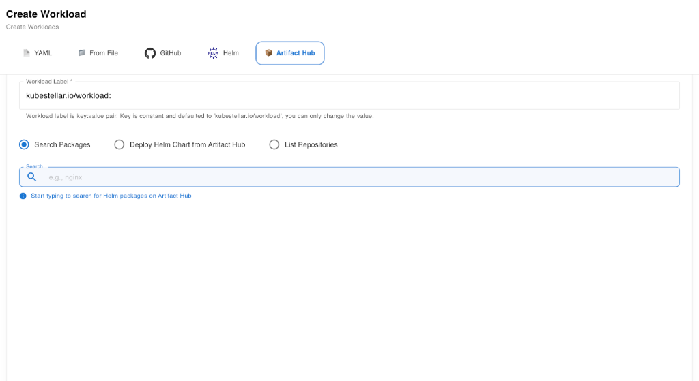
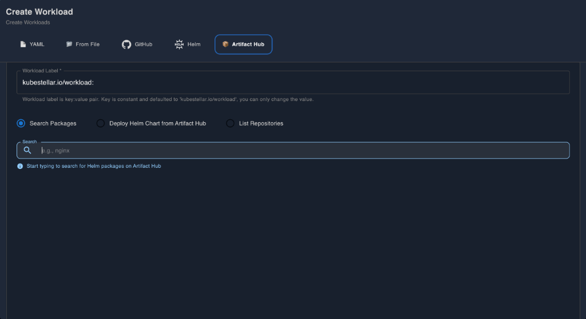

# WDS Workload Management

## Title and Introduction

**What is WDS?**
The Workload Distribution Space (WDS) is a central component of the KubeStellar UI designed for defining, visualizing, and managing Kubernetes workloads. It serves as the staging area where users can define what needs to be deployed before it is distributed to connected clusters.

**Purpose**
The primary purpose of WDS is to provide a unified interface for **Workload Definition and Distribution**. It abstracts the complexity of managing multi-cluster deployments by treating the WDS as a logical space where workloads are organized, validated, and prepared for propagation.

**When to use**
Use WDS when you need to:

- Managing Kubernetes workloads across multiple environments.
- Prepare applications for distribution to edge locations or multiple clusters.
- Visualize complex workload hierarchies and dependencies.
- Implement GitOps workflows for continuous delivery.

**Key Benefits**

- **Multiple Import Methods**: Flexibility to bring in workloads via File Upload, Helm, Git, URL, and more.
- **Visual Tree-based Organization**: Intuitive Hierarchical view of namespaces and resources.
- **GitOps Support**: Seamless integration with Git repositories for automated synchronization.
- **Helm Integration**: Built-in support for deploying and managing Helm charts.
- **Real-time Monitoring**: Instant feedback on workload status and health.

---

## Prerequisites

Before actively using the WDS Workload Management features, ensure the following prerequisites are met:

1.  **Kubernetes Cluster Access**: You must have access to the KubeStellar management cluster where WDS requires a connection.
2.  **WDS Context Configured**: A valid WDS context (e.g., `wds1`) must be selected in the context selector.
3.  **For Helm**: Helm repositories should be accessible from the environment if you plan to use custom charts.
4.  **For GitHub**: A GitHub Personal Access Token (PAT) may be required for accessing private repositories.
5.  **For GitOps**: Access rights to the target Git repository for setting up sync connections.
6.  **Network Connectivity**: Ensure the UI can reach external registries (ArtifactHub, GitHub) if using remote import methods.

---

## Feature Overview

### WDS Architecture

The WDS component acts as a control plane for workload definitions. It sits between the user intent (manifests) and the binding policies that determine where those workloads land (ITS clusters).

**Workload Organization**
Workloads in WDS are organized hierarchically:

- **WDS Context**: The top-level isolation boundary.
- **Namespaces**: Logical groups within a context.
- **Resource Types**: Groups of similar resources (Deployments, Services, Pods).
- **Resources**: The individual Kubernetes objects.

### Tree View Visualization

The integrated Tree View provides a React Flow-based visual representation of your workload structure.

- **Interactive Exploration**: Click nodes to expand/collapse namespaces and resource types.
- **Zoom and Pan**: Navigate large workload sets easily.
- **Color-coded Status**: Visual indicators for resource health (Green for Running, Red for Failed, Yellow for Pending).
- **Node Details**: Click any node to open the Workload Detail Panel.

---

## Step-by-Step Guides

### Guide 1: Uploading a YAML File

**Best for**: Ad-hoc deployments, legacy migrations, and quick testing.

1.  **Navigate** to the WDS page.
2.  Click the **"Create Workload"** button in the top action bar.
3.  Select the **"File Upload"** tab/method.
4.  **Drag and drop** your YAML file into the drop zone, or click to browse your local filesystem.
    - _Supported formats_: `.yaml`, `.yml`, `.json`.
    - _Features_: Multi-document YAML support.
5.  (Optional) Toggle **"Auto-create Namespace"** if your resources belong to a new namespace.
6.  Click **"Upload"**.
7.  **Verify**: Watch for the success notification and check the Tree View to see your new resources appear.

### Guide 2: Deploying a Helm Chart

**Best for**: Deploying complex, third-party applications (e.g., Nginx, Prometheus).

1.  Click **"Create Workload"** and select **"Helm Chart"**.
2.  **Search** for a chart (e.g., `nginx`).
    - The search integrates with ArtifactHub/configured repositories.
3.  **Select** the desired chart from the results list.
4.  Choose a **Version** from the dropdown menu.
5.  (Optional) **Customize Values**: Edit the `values.yaml` in the configuration editor to override defaults.
6.  Click **"Install"**.
7.  **Monitor**: The deployment status will be tracked in the WDS view.

### Guide 3: Connecting GitHub Repository

**Best for**: Importing specific files or directories from a repository without full GitOps sync.

1.  Click **"Create Workload"** and select **"GitHub"**.
2.  Enter the **Repository URL**.
3.  (If Private) Click "Add Credentials" to authentic with your **GitHub Token**.
4.  Select the **Branch** and navigate the file tree to select specific **Manifests** or **Directories**.
5.  (Optional) Configure a **Webhook** if you want to trigger updates on push.
6.  Click **"Import"**.

### Guide 4: Setting Up GitOps

**Best for**: Production pipelines, continuous delivery, and "Infrastructure as Code".

1.  Click **"Create Workload"** and select **"GitOps"**.
2.  Choose your **Git Provider** (GitHub, GitLab, etc.).
3.  Enter **Repository Details** and **Credentials**.
4.  Set the **Branch** and **Watch Path** (directory to sync).
5.  Configure **Sync Settings**:
    - _Sync Interval_: How often to check for changes.
    - _Auto-Sync_: Automatically apply changes found in git.
6.  Click **"Connect"**.
7.  A "GitOps Status" dashboard will appear showing sync history.

### Guide 5: Manual Workload Creation

**Best for**: Creating simple resources from scratch without writing YAML manually.

1.  Click **"Create Workload"** and select **"Manual Creation"**.
2.  Choose **Workload Type** (e.g., Deployment, Service) from the dropdown.
3.  Fill in the **Form Fields**:
    - **Name** & **Namespace**.
    - **Container Image** (e.g., `nginx:latest`).
    - **Ports**, **Env Vars**, and **Resource Limits**.
4.  Review the **Generated YAML** in the preview pane.
5.  Click **"Create"**.

### Guide 6: Using Marketplace Templates

**Best for**: Quick-starting with pre-configured best-practice templates.

1.  Click **"Create Workload"** and select **"Marketplace"**.
2.  **Browse Categories** (Databases, Web Servers, Monitoring) or search.
3.  Click on a **Template** card to view details.
4.  Review the default configuration.
5.  Click **"Deploy"**.

### Guide 7: Importing from URL

**Best for**: Importing raw manifests from Gists, Pastebin, or public raw URLs.

1.  Click **"Create Workload"** and select **"URL Import"**.
2.  Paste the **Direct URL** to the raw yaml/json content.
3.  Wait for the **Validation Preview** to load.
4.  Click **"Import"**.

---

## View Modes

The WDS interface offers versatile viewing options to suit different workflows.

- **Tiles View (React Flow)**: The default visual mode. Displays workloads as a graph designed for understanding structure and relationships.
- **List View**: A compact, text-based list capable of displaying hundreds of resources efficiently with sort/filter controls.
- **Table View** (Coming Soon): Detailed tabular data for easy comparison of metrics.

**Features**:

- **Toggle Button**: Switch instantly between views using the toggle in the header.
- **Persistence**: Your view preference is saved to `localStorage` and remembered on next visit.

---

## Workload Operations

Once workloads are created, you can perform various operations directly from the WDS UI:

1.  **View Details**: Click any node/item to open the Detail Panel.
    - Three tabs: **Summary**, **YAML**, **Logs/Events**.
2.  **Edit Manifest**: Go to the "Edit" tab in the detail panel to modify the YAML/JSON directly. Changes are applied immediately upon save.
3.  **Scale**: For Deployments/StatefulSets, adjust the replica count.
4.  **Delete**: Remove workloads (Caution: This is irreversible).
5.  **Restart**: Trigger a rollout restart for Deployments.
6.  **Logs**: View live container logs for running Pods.

**Workload Lifecycle Status**:

- **Running**: Healthy and active.
- **Pending**: Waiting for resources or scheduling.
- **Failed**: Terminated with error.
- **CrashLoopBackOff**: Repeatedly failing to start.

---

## Use Cases

### Use Case 1: Development to Production (GitOps)

**Scenario**: You want to deploy an application and promote it from Development to Production environments automatically.
**Solution**:

1.  Use **Method 4 (GitOps)**.
2.  Configure WDS to sync a "dev" directory to the WDS context.
3.  Developers push to the "dev" branch/folder.
4.  WDS detects the commit and updates the workload definition.
5.  Binding Policies (configured separately) distribute this WDS workload to the connected Dev Clusters.

### Use Case 2: Quick Testing (Helm)

**Scenario**: You need to test a new version of the Nginx Ingress Controller.
**Solution**:

1.  Use **Method 2 (Helm)**.
2.  Search for `ingress-nginx`.
3.  Select the specific `beta` version you want to test.
4.  Deploy to a temporary namespace `test-ingress`.
5.  Verify behavior in the Tree View.
6.  Delete the workload when finished.

### Use Case 3: Legacy App Migration (File Upload)

**Scenario**: You have a folder of existing YAML manifests from an old cluster.
**Solution**:

1.  Use **Method 1 (File Upload)**.
2.  Select all YAML files in your local folder.
3.  Drag them into the upload zone.
4.  WDS validates and creates all resources, preserving the defined namespaces.

---

## Troubleshooting

| Issue                    | Possible Cause                             | Solution                                                           |
| :----------------------- | :----------------------------------------- | :----------------------------------------------------------------- |
| **File Upload Fails**    | Invalid YAML/JSON syntax                   | Validate your file with a linter before uploading.                 |
| **Helm Chart Not Found** | Repo not configured or network issue       | Check your internet connection or add the custom Helm repo URL.    |
| **GitHub Import Error**  | Token expired or insufficient permissions  | Regenerate your PAT with `repo` scope and update credentials.      |
| **Namespace Missing**    | Namespace was not defined in manifest      | Enable "Auto-create Namespace" or define it in your YAML metadata. |
| **Validation Error**     | Missing required fields (e.g., apiVersion) | Ensure your manifests adhere to Kubernetes schema standards.       |

---

## API Reference

The WDS backend exposes several endpoints for managing workloads programmatically.

| Method | Endpoint         | Description                                                    |
| :----- | :--------------- | :------------------------------------------------------------- |
| `POST` | `/api/resources` | Upload raw YAML/JSON workloads. query param: `auto_ns=true`    |
| `POST` | `/api/deploy`    | Trigger a Git deployment. Params: `repo_url`, `branch`, `path` |
| `POST` | `/deploy/helm`   | Deploy a Helm chart. Params: `chartName`, `repoUrl`            |
| `GET`  | `/api/workloads` | Retrieve the list of current workloads for the tree view.      |

For full API documentation, please refer to the OpenAPI/Swagger documentation at `/api/docs`.

---

## Related Features

- **ITS (Infrastructure Transport Space)**: The destination clusters where workloads defined in WDS are eventually run.
- **Binding Policies**: The rules (managed in BP view) that link WDS workloads to ITS clusters.
- **WECS (Workload Execution Control Space)**: The monitoring layer that reports back status from the ITS clusters to WDS.

---

_Questions? Contact the platform engineering team or file an issue in the repository._
