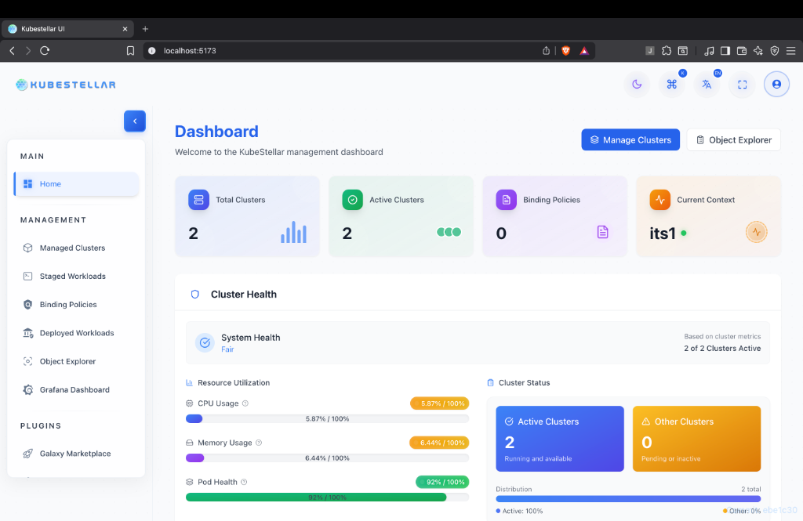
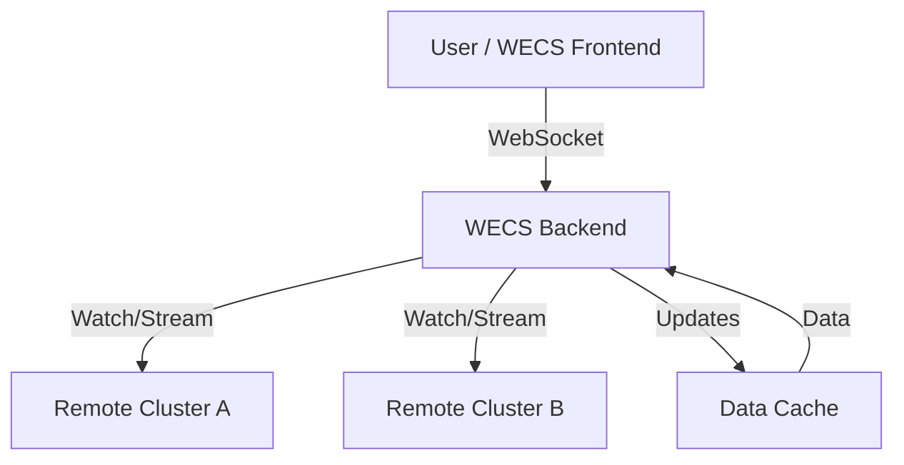
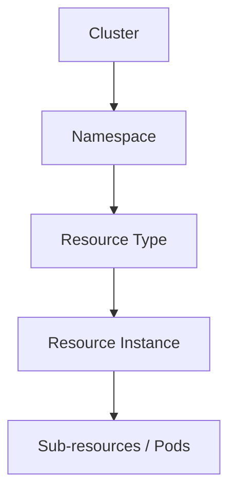
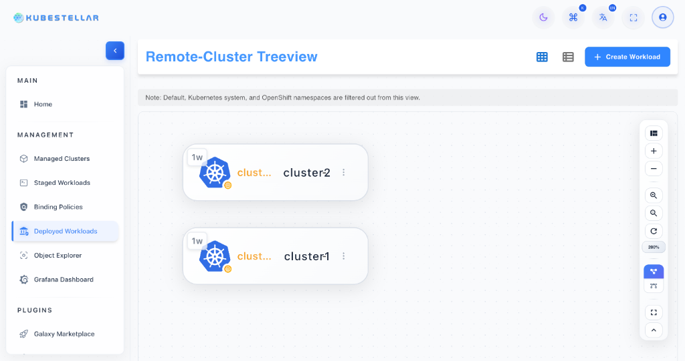
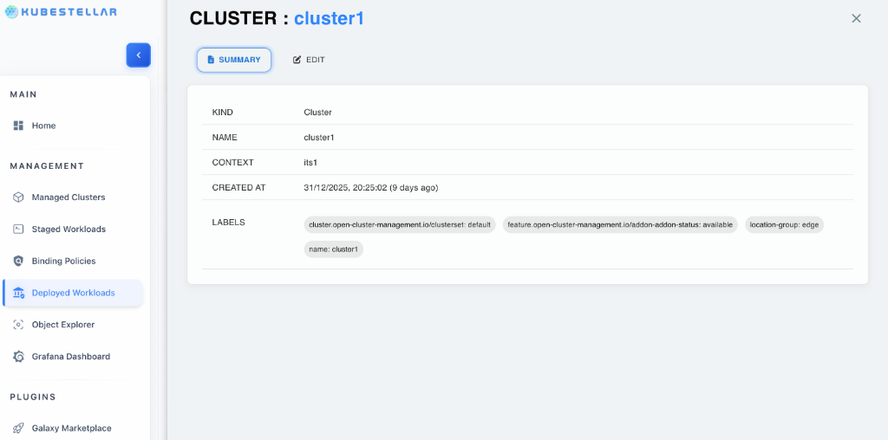
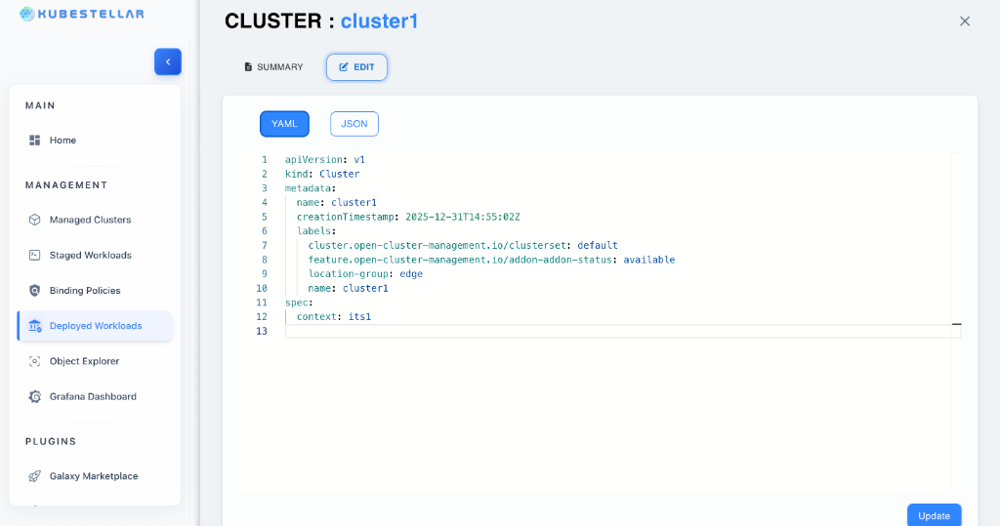
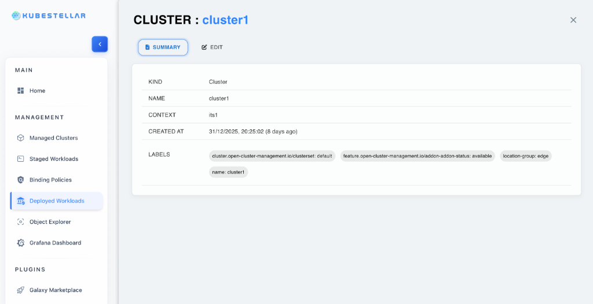
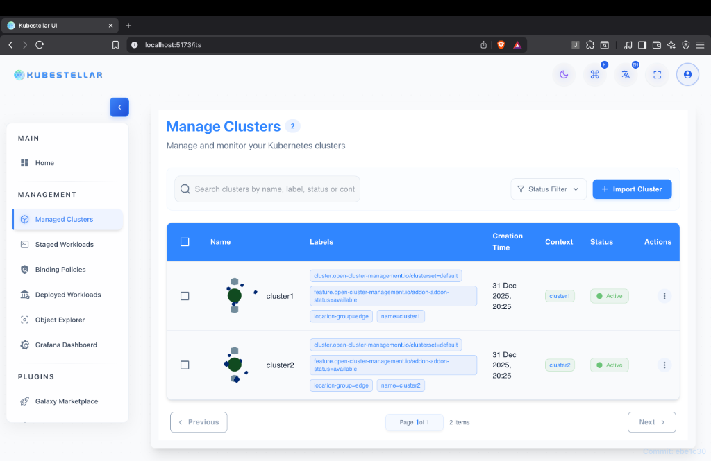
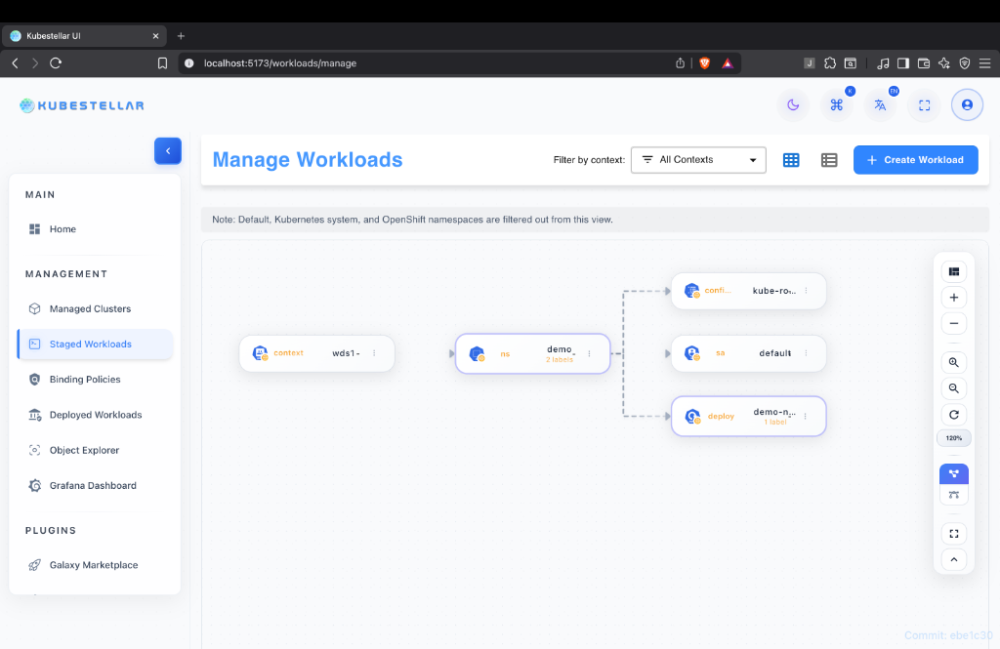
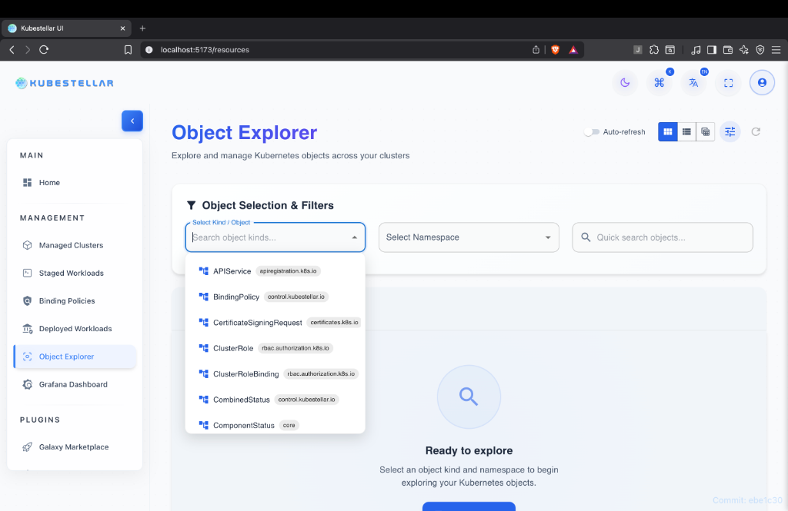

# WECS (Workload Execution Cluster Space) Remote Monitoring

## 1. Introduction

**What is WECS?**
WECS (Workload Execution Cluster Space) is a comprehensive monitoring interface designed for visualizing and managing remote workloads across multiple Kubernetes clusters. It provides a unified view of your distributed infrastructure, allowing operations teams and developers to inspect resources, view live logs, and troubleshoot issues without needing direct access to each cluster's API server.

**Purpose**
The primary purpose of WECS is to facilitate **remote cluster monitoring**. It bridges the gap between centralized management and distributed execution, ensuring that users have full visibility into the state of their applications regardless of where they are running.

**When to use**
Use WECS when you need to:
- Monitor workloads deployed via the **Binding Policy (BP)** mechanism.
- Debug application failures in remote clusters.
- Verify that resources are correctly propagated and running.
- Access container logs in real-time.

**Key Benefits**
- **Real-time Visibility**: Instant updates on resource status and cluster health.
- **Live Logs**: Stream logs directly from remote containers via WebSocket.
- **Hierarchical Organization**: Intuitive tree view for navigating complex multi-cluster environments.
- **WebSocket-based Efficiency**: Low-latency data transmission for immediate feedback.



---

## 2. Prerequisites

Before using the WECS remote monitoring features, ensure the following prerequisites are met:

- **Clusters Imported**: Target clusters must be imported into the Inventory Transform Service (ITS).
- **Workloads Deployed**: Workloads should be deployed and managed via Binding Policies (BP).
- **WECS Agent**: The WECS agent must be running on the remote clusters (if required for your specific architecture).
- **Network Connectivity**: Ensure network connectivity between the WECS backend and the remote clusters.
- **WebSocket Support**: The client browser and network path must support WebSocket connections for real-time streaming.

---

## 3. Feature Overview

### WECS Architecture
The WECS architecture is designed for real-time, bi-directional communication:



**Data Flow**:
1.  **Cluster → WebSocket → Backend**: Agents or API watchers on remote clusters stream changes to the backend.
2.  **Backend → Cache**: Data is cached for performance and quick retrieval.
3.  **Backend → Frontend**: The frontend receives real-time updates via a WebSocket connection.

### WebSocket Connection Model
- **Live Connection**: Maintains a persistent WebSocket connection to selected clusters.
- **Automatic Reconnection**: Automatically attempts to reconnect if the connection is dropped, featuring a smart backoff retry strategy.
- **Connection Indicators**:
    - 🟢 **Connected**: Real-time stream active.
    - 🟡 **Connecting**: Attempting to establish connection.
    - 🔴 **Disconnected**: Connection lost, click to reconnect.
- **Connection Pooling**: Efficiently manages connections to multiple clusters simultaneously.
- **Data Updates**: Incremental updates for resource changes (Created, Updated, Deleted).

### Resource Hierarchy
WECS organizes resources in a logical, drill-down tree structure:



- **Cluster** (Top Level): Displays cluster name, status, and total resource count.
    - **Namespace**: Groups resources logically, color-coded by status.
        - **Resource Type** (e.g., Deployments, Pods): Grouped by Kind.
            - **Resource Instance**: Specific named resource with status icons (Running/Pending/Failed).
                - **Sub-resources**: e.g., individual Pods within a Deployment.

---

## 4. Step-by-Step Guides

### Guide 1: Navigating the WECS Tree

1.  **Open WECS Page**: Navigate to the WECS section of the application.
2.  **View Monitored Clusters**: You will see a list of top-level nodes for each monitored cluster.
    *   *Visual Indicator*: Check the connection status dot (🟢 Connected, 🟡 Connecting, 🔴 Disconnected).
3.  **Expand Cluster**: Click the arrow or name of a cluster to reveal its Namespaces.
    *   *Info*: Shows resource counts per cluster.
4.  **View Namespaces**: Browses the list of Namespaces containing managed resources.
    *   *Filter*: Only namespaces with resources are displayed.
5.  **Expand Namespace**: Click a Namespace to see the grouped Resource Types (e.g., Deployments, Services).
6.  **Select Resource Type**: Click on a type (e.g., "Pods") to expand and list individual resources.
7.  **View Details**: Click on a specific resource name to open the **Resource Details Panel**.



### Guide 1.1: Viewing and Editing Cluster Summary

1.  **Select Cluster Node**: Click on the top-level cluster node (e.g., `cluster1`) in the tree view.
2.  **View Summary**: The right panel will display the **Cluster Summary**, including:
    *   **Kind**: Resource kind (Cluster).
    *   **Name**: Name of the cluster.
    *   **Context**: The context used for connection.
    *   **Created At**: Timestamp of creation.
    *   **Labels**: Associated labels.



3.  **Edit Configuration**: Switch to the **Edit** tab to view or modify the cluster's YAML/JSON configuration.
    *   Toggle between **YAML** and **JSON** views.
    *   Make changes and click **Update** to apply.



### Guide 2: Viewing Resource Details

1.  **Navigate to Resource**: Use the tree view to find the specific resource you want to inspect.
2.  **Click Resource Name**: This opens the detail panel on the right side.
3.  **Resource Details Tabs**:

    ```mermaid
    graph LR
        Panel[Resource Details] --> Summary
        Panel --> Edit
        Panel --> Logs
        Panel --> Events
    ```

    *   **Summary**:
        *   **Basic Info**: Resource Name, Namespace, Kind, Cluster, Creation Timestamp, UID, Resource Version, API Version.
        *   **Status**: Overall status (Ready/Not Ready), Replicas (Desired/Available), Conditions (Type/Status/Reason/Message).
        *   **Labels/Annotations**: Complete key-value pairs with copy functionality.
        *   **Spec**: Selector, Images, Ports, Env Variables, Volume Mounts, Requests/Limits.
    *   **Edit**: Full YAML/JSON manifest editor with syntax highlighting, line numbers, and copy/download/save options.
    *   **Logs**: Live multi-container log streaming with search, filter, and tail controls.
    *   **Events**: History of events with timestamps, types (Normal/Warning), and messages.



### Guide 3: Streaming Live Logs

1.  **Open Resource Details**: Navigate to a Pod or a controller (like a Deployment) that manages pods.
2.  **Go to Logs Tab**: Click the **Logs** tab in the details panel.
3.  **Select Container**: Dropdown to select container (supports multi-container, init, and sidecar).
4.  **Configure View**:
    *   **Tail Lines**: Select number of previous lines to load (50, 100, 500, All).
    *   **Follow Mode**: Toggle to auto-scroll as new logs arrive.
5.  **Watch Real-time Logs**: Observe the log stream.
    *   *Visual Aid*: **ERROR** logs in red, **WARN** in yellow, **INFO** in blue.
    *   *Features*: Line numbers, word wrap toggle, timestamp display.
6.  **Controls**:
    *   **Search**: Filter logs by keyword.
    *   **Download**: Export logs to file.
    *   **Clear/Refresh**: Manage the current view.

> [!IMPORTANT]
> **Screenshot Required**: Logs tab with live streaming active.
> *Target*: `./assets/resource-details-logs.png`

### Guide 4: Using Search and Filters

1.  **Locate Filter Bar**: Found at the top of the WECS interface or within specific views.
2.  **Search by Name**: Type a resource name (e.g., `redis`) in the global search bar to jump to it.
3.  **Filter by Status**:
    *   Click the **Status** dropdown.
    *   Select **Running**, **Pending**, or **Failed** to narrow down the visible resources.
4.  **Filter by Namespace**: Use the namespace dropdown to focus on a specific environment (e.g., `production`).
5.  **Clear Filters**: Click the **Clear All** button to reset the view to default.


*(Note: Dashboard shows global filter context)*


---

## 5. Interactive Features

- **Navigation**:
    - **Breadcrumbs**: Use top navigation to jump back levels.
    - **Back Button**: Close detailed views to return to the tree.
- **Search and Filter**:
    - **Search**: Find resources by name globally.
    - **Filter**: Narrow down by **Type**, **Namespace**, or **Status** (Running/Pending/Failed).
- **Actions**:
    - **Refresh**: Manually refresh cluster or resource data.
    - **Delete**: Remove a resource (requires confirmation).
    - **Edit**: Modify resource YAML directly.
    - **Export**: Copy resource name or export YAML.
- **Auto-Refresh**:
    - Toggle auto-refresh with configurable intervals (5s, 10s, 30s, 60s).
    - View **Last Updated** timestamp.

---

## 6. Use Cases

### Use Case 1: Troubleshooting Failed Deployments
**Scenario**: A deployment is showing `0/3` pods ready.
**Solution**:
1.  Navigate to the **Deployment** in the WECS tree.
2.  Check the **Summary** tab for **Conditions**. Look for "False" status on Availability.
3.  Switch to the **Events** tab. Look for "Warning" events (e.g., `FailedScheduling`, `ImagePullBackOff`).
4.  If the issue is application-related, find the child **Pod**.
5.  Open the **Logs** tab to see stack traces or errors.

### Use Case 2: Live Log Monitoring
**Scenario**: Monitoring application rollout errors.
**Solution**:
1.  Open the main **Pod** for your application.
2.  Go to the **Logs** tab and select the app container.
3.  Enable **Follow** mode.
4.  Use **Search** to highlight "Exception" or specific error codes.
5.  **Download** logs for offline analysis.

### Use Case 3: Multi-Cluster Health Check
**Scenario**: Verifying critical service health across regions.
**Solution**:
1.  In the tree view, collapse all clusters to top-level.
2.  Verify the **Status Indicator** is green for all clusters.
3.  Compare **Resource Counts** to ensure symmetry across regions.
4.  Click on the service in each cluster to verify "Active" or "Ready" status.

---

## 7. Resource Type Coverage

WECS supports monitoring a wide range of Kubernetes resources:

**Workload Resources**
- Deployments, StatefulSets, DaemonSets, ReplicaSets, Jobs, CronJobs, Pods

**Service Resources**
- Services (ClusterIP, NodePort, LoadBalancer), Endpoints, Ingresses

**Configuration Resources**
- ConfigMaps, Secrets

**Storage Resources**
- PersistentVolumes, PersistentVolumeClaims, StorageClasses

**Custom Resources**
- Support for CRDs and dynamic resource type detection.

---

## 8. Troubleshooting

### Issue 1: WebSocket disconnects frequently
*   **Symptoms**: The connection indicator flashes red/yellow often; logs stop streaming.
*   **Solutions**:
    *   Check your local network stability.
    *   Verify firewall rules are not blocking WebSocket (WS/WSS) traffic.
    *   If you are an admin, check the backend logs for timeout errors and consider increasing timeout settings.

### Issue 2: Logs not streaming
*   **Symptoms**: The Logs tab is empty or shows a loading spinner indefinitely.
*   **Solutions**:
    *   Verify the specific container is actually **Running**. Logs are not available for `Pending` pods.
    *   Try selecting a different container (e.g., switching from `istio-proxy` to the main app).
    *   Check if the **WECS Agent** on the remote cluster is healthy.

### Issue 3: Resources not showing
*   **Symptoms**: The tree view is empty or missing expected resources.
*   **Solutions**:
    *   Verify the cluster shows as **Connected**.
    *   Check if the namespace you are looking for is excluded by permissions.
    *   Click the **Refresh** button on the cluster node to force a re-sync.
    *   Try reconnecting the WebSocket manually.

### Issue 4: Slow loading
*   **Symptoms**: Expanding nodes takes a long time.
*   **Solutions**:
    *   Enable **Auto-refresh** with a longer interval (e.g., 60s) to reduce backend load.
    *   Use **Filters** to drill down to a specific namespace instead of loading everything.
    *   Reduce **Tail Lines** requested in the Logs tab.

---

## 9. API/Integration Reference

**Backend Endpoints**
*   `GET /api/wecs/clusters` - List monitored clusters
*   `GET /api/wecs/:cluster/resources` - Get all resources for a cluster
*   `GET /api/wecs/:cluster/:namespace/:kind/:name` - Get specific resource details
*   `GET /api/wecs/:cluster/logs` - Stream logs
*   `GET /api/wecs/:cluster/events` - Get resource events

**WebSocket Channels**
*   Endpoint: `/ws/wecs/:cluster`
*   **Messages**: `ResourceCreated`, `ResourceUpdated`, `ResourceDeleted`, `StatusChanged`, `EventReceived`.

---

## 10. Related Features

- **ITS Integration**: WECS retrieves the list of clusters from the Inventory Transform Service.


- **Binding Policy (BP)**: WECS focuses on monitoring workloads that were deployed via Binding Policies.


- **Object Explorer**: For a broader, non-cluster-specific view of resources, use the Object Explorer.


---

*(Screenshots and Diagrams Referenced)*
*   *WECS Tree View Overview*
*   *Cluster Node Expanded*
*   *Namespace Expanded*
*   *Summary Tab*
*   *Edit Tab*
*   *Logs Tab*
*   *Events Tab*
*   *WebSocket Indicators*
*   *Search and Filter*
